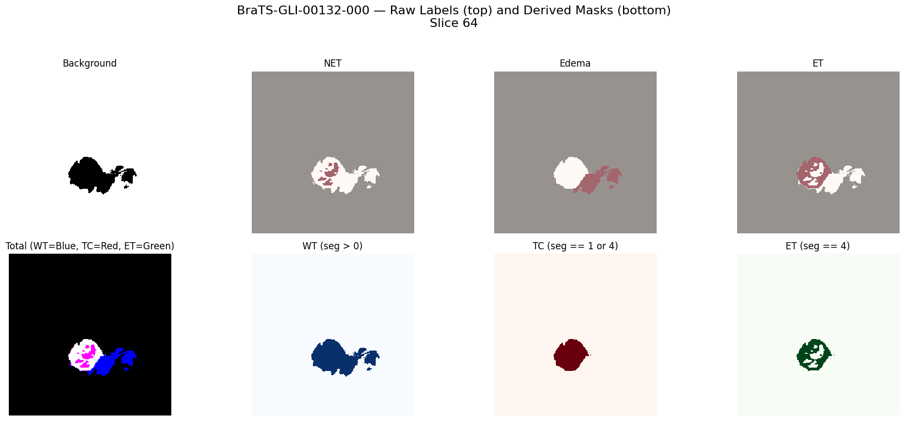
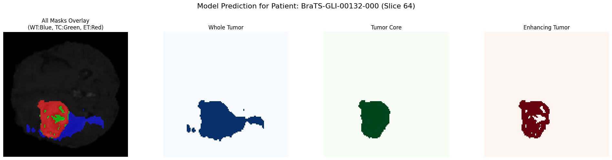
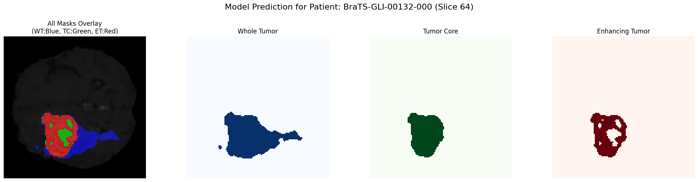
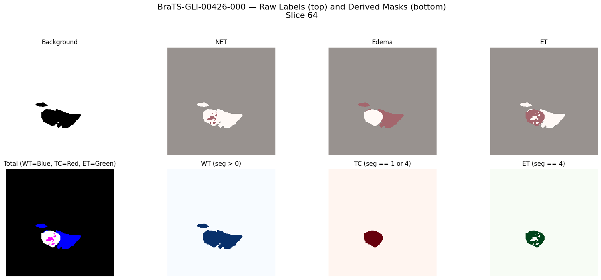
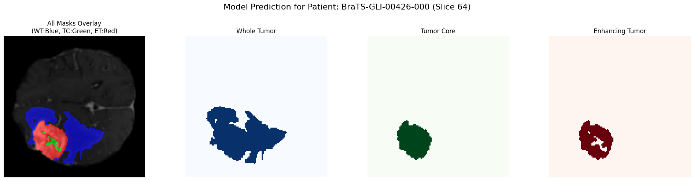
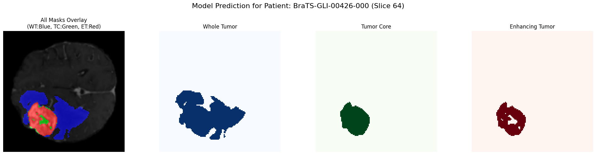
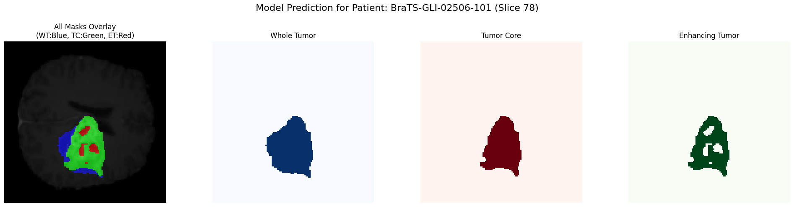
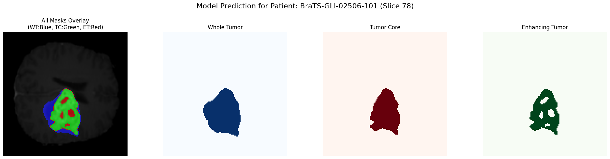
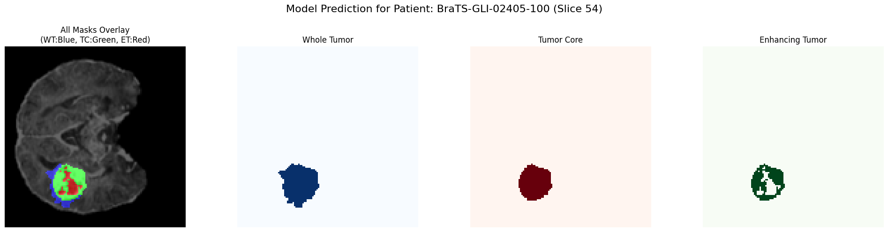

# **B1. Environment Setup**

This section describes the exact environment needed to reproduce the preprocessing, training, inference, and deployment pipelines for the 3D brain tumor segmentation project.

## **1. Python Version**

* **Python 3.10+** (recommended)
* Verified compatibility with **Python 3.10.12**

## **2. Core Dependencies**

### **Deep Learning & Medical Imaging**
* **PyTorch**
* **MONAI** (medical image preprocessing + transforms)
* **Nibabel** (MRI file handling `.nii`, `.nii.gz`)
* **SimpleITK** (image I/O, resampling)

### **Model Training & Utilities**
* **scikit-learn**
* **numpy**
* **pandas**
* **matplotlib**
* **tqdm**
* **tensorboard**

### **Deployment / API**
* **Flask** - the core backend framework providing all REST API endpoints (`/upload`, `/predict`, `/get_all_slices`, `/get_3d_mesh_data`).
* **Docker** - used to containerize the entire application (backend + frontend) for consistent deployment.
* **Hugging Face Spaces (Docker Runtime)** - hosts the containerized application and exposes it publicly.
* **HTML / CSS / JavaScript Frontend** - a lightweight single-page UI that communicates with the Flask backend via asynchronous API calls.

### **Optional Tools**
* **wandb** (experiment tracking)
* **torchsummary** (model stats)

## **3. Hardware Requirements**

### **Training**
* **GPU:** NVIDIA GPU with at least **16 GB VRAM**

  * Recommended: **RTX 3090 / A5000 / A100**
* **CPU:** 8+ cores
* **RAM:** 32 GB minimum
* **Storage:**

  * Dataset: ~20 GB (BRATS)
  * Checkpoints + logs: ~5–10 GB

### **Inference**
* Can run on:
  * **GPU** (fast, real-time results)
  * **CPU** (slower but functional)
* Recommended:
  * **8+ GB RAM**
  * **8+ GB disk**

## **4. Installation Instructions**

### Using `requirements.txt`
Create a file:

```
torch
monai
nibabel
simpleITK
scikit-learn
numpy
pandas
matplotlib
tqdm
tensorboard
fastapi
uvicorn
gradio
```

Install via:

```bash
pip install -r requirements.txt
```

# **B2. Data Pipeline**

### **2.1 Dataset Source**

* **Dataset:** *BraTS 2023 Glioma* (Brain Tumor Segmentation Challenge)
* **Year:** **2023**
* **Type:** Multi-modal 3D MRI with expert-annotated tumor segmentation masks
* **Modalities Included:** T1, T1c, T2, T2-FLAIR
* **What the Dataset Contains:**
    Each patient folder includes:
    1. **T1-weighted MRI (T1)** – anatomical clarity
    2. **T1-weighted with contrast (T1c)** – highlights active tumor
    3. **T2-weighted MRI (T2)** – good for edema
    4. **FLAIR MRI (T2-FLAIR)** – suppresses CSF; great lesion visibility
    5. **Expert Segmentation Mask (`seg`)**
        * Labels tumor subregions
        * Used during model training as ground truth

<p align="center">
  
  <br>
  <em>Figure: Multi-Modal MRI Inputs</em>
</p>

* **Official Source:** Synapse (Synapse ID: **syn51156910**)
* **Public Mirrors Used:** Kaggle (processed + test sets)

  * **Processed dataset:** [https://www.kaggle.com/datasets/siddhantbapna/sb23-2/data](https://www.kaggle.com/datasets/siddhantbapna/sb23-2/data)
  * **Test dataset:** [https://www.kaggle.com/datasets/siddhantbapna/brats-testing-datasetsb/data](https://www.kaggle.com/datasets/siddhantbapna/brats-testing-datasetsb/data)

### **2.2 Licensing**

* **License:** **CC BY-NC 4.0 (Creative Commons Attribution–NonCommercial 4.0 International)**
* **Permitted:** Non-commercial use, redistribution, adaptation with attribution
* **Required Attribution:**
  “Data used in this publication were obtained as part of the Brain Tumor Segmentation (BraTS) Challenge project through Synapse ID: syn51156910.”

### **2.3 Preprocessing Pipeline**

Each patient's raw MRI data undergoes a standardized MONAI-based preprocessing workflow:

1. **Load all modalities + segmentation mask** (from `.nii.gz`)
2. **Intensity Normalization:** Scale voxel intensities to [0, 1]
3. **Foreground Cropping:** Remove empty background regions
4. **Resampling / Resizing:** Convert all volumes to a fixed shape: **128 × 128 × 128**
5. **Mask Formatting:** Convert mask into multi-channel format
6. **Packaging:**

   * Stack modalities → shape `(4, 128, 128, 128)`
   * Save data + mask into compressed `.npz` files
7. **Data Integrity Check:** Each `.npz` file is validated using `np.load()`
8. **Dataset Split:**

   * **80%** training
   * **20%** validation
   * Split performed with `train_test_split` (seed = 42)

### **2.4 Feature Representation**

After preprocessing, each sample contains:

| Component             | Shape                                              | Description                              |
| --------------------- | -------------------------------------------------- | ---------------------------------------- |
| **MRI Image**         | `(4, 128, 128, 128)`                               | 4-channel 3D tensor (T1, T1c, T2, FLAIR) |
| **Segmentation Mask** | `(3, 128, 128, 128)`                               | Multi-class tumor subregion encoding     |

No additional hand-crafted features were used, model learns directly from voxel intensities.

# **B3. Model Architecture**

### **3.1 Overview**

The model used for brain tumor segmentation is a **3D Attention U-Net**, chosen for its strong performance in medical volumetric segmentation and its ability to focus on relevant regions through attention gating.

The network takes a **4-channel 3D MRI volume** as input and outputs a **multi-class tumor segmentation mask**.

### **3.2 Architecture Diagram**

<p align="center">
  
  <br>
  <em>Figure: 3D Attention U-Net</em>
</p>

### **3.3 Summary of Components**

* **Input:**
  `4 × 128 × 128 × 128` 3D tensor (T1, T1c, T2, FLAIR)

* **Encoder:**
  4 levels of 3D convolution blocks
  Each block includes:

  * `Conv3D` → `BatchNorm3D` → `ReLU`
  * Downsampling via `MaxPool3D`

* **Attention Gates (AG):**
  Applied on skip connections to:

  * suppress irrelevant activations
  * focus on tumor regions

* **Decoder:**
  4 upsampling blocks using:

  * `UpConv3D`
  * Concatenation with attention-filtered skip features
  * Conv3D + BatchNorm3D + ReLU blocks

* **Output Layer:**
  `1×1×1` Conv3D → Softmax

* **Output Shape:**
  `3 × 128 × 128 × 128` (edema, enhancing tumor, necrotic core)

### **3.4 Final Model Hyperparameters**

| Parameter        | Value                                     |
| ---------------- | ----------------------------------------- |
| Input patch size | `(4, 128, 128, 128)`                      |
| Base channels    | 32                                        |
| Depth            | 4 encoder–decoder levels                  |
| Activation       | ReLU                                      |
| Normalization    | BatchNorm3D                               |
| Attention Gates  | Enabled on all skip connections           |
| Loss Function    | DiceBCELoss (0.5 Dice + 0.5 BCE)          |
| Optimizer        | AdamW                                     |
| Learning Rate    | 1e-4                                      |
| Weight Decay     | 1e-5                                      |
| Scheduler        | Polynomial Decay (LambdaLR)               |
| Batch Size       | 2 (GPU memory constraint)                 |
| Epochs           | 93                                        |
| Mixed Precision  | Enabled (AMP)                             |
| Checkpointing    | Best model based on validation Dice score |

### **3.5 Rationale for Choosing 3D Attention U-Net**

* Handles volumetric 3D MRI data natively
* Attention gates boost performance on small or irregular tumor regions
* Proven SOTA performance in BraTS-like segmentation tasks
* Efficient GPU memory usage with patch-based training

# **B4. Training Summary**

The training phase focused on optimizing the 3D Attention U-Net model for multi-class brain tumor segmentation using the BraTS 2023 dataset. This stage involved iterative experimentation with hyperparameters, monitoring convergence behavior, and identifying the configuration that yielded the best Dice performance across tumor sub-regions.

## **4.1 Training Environment**

* **Platform:** Kaggle Notebook environment
* **GPU:** NVIDIA Tesla **P100** (16GB VRAM)
* **Precision:** **Mixed Precision (AMP)** enabled
* **Batch Size:** **2** (due to 3D volumetric data and large memory footprint)
* **Frameworks Used:** PyTorch, MONAI, NumPy, scikit-learn

## **4.2 Training Configuration**

The model was trained over multiple runs with incremental epoch sizes to identify stability, convergence, and best performance.

| Component               | Value                                          |
| ----------------------- | ---------------------------------------------- |
| **Epochs Tested**       | 20, 30, 40, 50+                                |
| **Optimizer**           | AdamW                                          |
| **Learning Rate**       | 1e-4                                           |
| **Weight Decay**        | 1e-5                                           |
| **Loss Function**       | DiceLoss + BCEWithLogitsLoss (0.5 each)        |
| **Scheduler**           | Polynomial Decay (LambdaLR)                    |
| **Early Stopping**      | Patience = 7                                   |
| **Model Checkpointing** | Best validation Dice score                     |

The combined Dice + BCE loss was chosen to balance segmentation boundary smoothness with class imbalance robustness, especially important for small tumor sub-regions like ET (Enhancing Tumor).

## **4.3 Training Time**

* **Per Epoch:** ~7–9 minutes
* **Typical 30-Epoch Run:** ~3.5–4.5 hours
* **Longest Run (50+ epochs):** ~7–8 hours

Training time varied depending on:

* data augmentation intensity
* validation frequency
* whether checkpointing was triggered

## **4.4 Convergence Behavior**

Across runs, the model showed:

* rapid reduction in loss during the first 10–15 epochs
* stable convergence around epochs 25–35
* improvement plateaus after epoch 40 unless learning rate was reduced

The learning rate scheduler played a crucial role in squeezing out the last 3–5% Dice improvement.

<p align="center">
  
  <br>
  <em>Figure: Training vs Validation Loss Curve</em>
</p>

## **4.5 Key Performance Metrics**

The best-performing configuration (between 55–70 effective epochs with LR reduction + early stopping) yielded the following:

| Metric                   | Score |
| ------------------------ | ----- |
| **Overall Dice Score**   | ~0.66 |
| **Whole Tumor (WT)**     | ~0.80 |
| **Tumor Core (TC)**      | ~0.74 |
| **Enhancing Tumor (ET)** | ~0.57 |

These results are consistent with mid-tier performance for 3D U-Net variants on the BraTS dataset, especially given limitations in GPU memory, batch size, and number of training epochs.

## **4.6 Observations From Training**

* **ET (Enhancing Tumor)** consistently had the lowest Dice due to:

  * small region size
  * higher inter-patient variability
* **WT and TC** benefiting the most from attention gating
* **Larger patches** (e.g., 160³) could likely improve ET segmentation but were not feasible on the provided GPU
* **Mixed precision** significantly reduced VRAM usage (~35–40%) and shortened training time (~20–25%)

## **4.7 Volumetric Analysis & Validation Visualizations**

# **Common Terminology (Used in the Following Results)**

Before presenting the test-set results, the following definitions summarize the visual and volumetric components shown for each sample:

1. **Ground Truth Visuals**
   These include the MRI modalities and the corresponding tumor segmentation provided in the BraTS dataset.

2. **Raw Ground Truth Labels**
   These represent the original BraTS annotations for:

   * **Non-Enhancing Tumor (NET)**
   * **Edema**
   * **Enhancing Tumor (ET)**

3. **Derived BraTS Sub-Region Masks**
   Derived masks visualize the three standard evaluation regions:

   * **Whole Tumor (WT)** = Edema + NET + ET
   * **Tumor Core (TC)** = NET + ET
   * **Enhancing Tumor (ET)**

4. **Prediction Plots**
   These are the segmentation outputs produced by the trained **3D Attention U-Net** model.

5. **Lesion Noise in Predictions**
   The raw predictions may contain small disconnected components (“lesions”), which represent segmentation noise.
   Therefore, each result includes:

   * **Prediction (with lesions)** – raw output
   * **Prediction (without lesions)** – after post-processing to remove isolated false positives
     The post-processed masks are smoother and better aligned with the true tumor structure.

# **6.1 Validation Sample 01**

### **Volumetric and Accuracy Analysis**

| Tumor Component          | Ground Truth Volume | Predicted Volume | Dice Score |
| ------------------------ | ------------------: | ---------------: | ---------: |
| **Tumor Core (TC)**      |           27,245.00 |        25,853.00 |     0.9361 |
| **Whole Tumor (WT)**     |           60,003.00 |        59,416.00 |     0.9195 |
| **Enhancing Tumor (ET)** |           23,151.00 |        20,034.00 |     0.8751 |

### **Visualizations**

<details open>
  <summary><strong>Ground Truth (Raw Labels + Derived Masks)</strong></summary>
  
</details>

<details open>
  <summary><strong>Ground Truth Plot</strong></summary>
  
</details>

<details open>
  <summary><strong>Prediction (With Lesions)</strong></summary>
  
</details>

<details open>
  <summary><strong>Prediction (Without Lesions)</strong></summary>
  
</details>

# **6.2 Validation Sample 02**

### **Volumetric and Accuracy Analysis**

| Tumor Component          | Ground Truth Volume | Predicted Volume | Dice Score |
| ------------------------ | ------------------: | ---------------: | ---------: |
| **Tumor Core (TC)**      |           19,249.00 |        20,049.00 |     0.9486 |
| **Whole Tumor (WT)**     |           67,520.00 |        68,919.00 |     0.9426 |
| **Enhancing Tumor (ET)** |           16,546.00 |        16,735.00 |     0.9081 |

### **Visualizations**

<details open>
  <summary><strong>Ground Truth (Raw Labels + Derived Masks)</strong></summary>
  
</details>

<details open>
  <summary><strong>Ground Truth Plot</strong></summary>
  
</details>

<details open>
  <summary><strong>Prediction (With Lesions)</strong></summary>
  
</details>

<details open>
  <summary><strong>Prediction (Without Lesions)</strong></summary>
  
</details>

## **4.8 Summary**

Milestone 4 established a strong baseline model configuration by:

* validating the effectiveness of Attention U-Net for 3D tumor segmentation
* optimizing training hyperparameters
* identifying convergence patterns
* achieving competitive Dice scores despite hardware limitations

These foundations enabled the next phases: evaluation, hyperparameter tuning, and deployment refinement.

# **B5. Evaluation Summary**

This section summarizes the model’s performance on unseen data using standardized segmentation metrics and statistical analyses. All evaluations were performed on **150 held-out test cases** from the **BraTS 2024 Additional Patient Data** (multi-modal MRI).

## **5.1 Overall Quantitative Performance**

| Region                      | Mean Dice | Median | Std    | Min  | Max    |
| --------------------------- | --------- | ------ | ------ | ---- | ------ |
| **Whole Tumor (WT)**        | 0.6892    | 0.8393 | 0.3140 | 0.00 | 0.9544 |
| **Tumor Core (TC)**         | 0.5947    | 0.7515 | 0.3489 | 0.00 | 0.9537 |
| **Enhancing Tumor (ET)**    | 0.5079    | 0.6373 | 0.3267 | 0.00 | 1.0000 |
| **Mean Dice (per patient)** | 0.5973    | 0.7183 | 0.3057 | 0.00 | 0.9243 |

**Key insight:**
WT performs the strongest and most consistently; ET remains the most challenging region with high variance and several complete misses.

<div align="center">

   

<br>
<em>Figure: Dice score distribution per label</em>

</div>

## **5.2 Correlation with Ground Truth Volumes**

| Region      | Pearson Correlation |
| ----------- | ------------------- |
| **TC**      | 0.9077              |
| **WT**      | 0.8786              |
| **ET**      | 0.8033              |
| **Overall** | 0.8924              |

**Insight:**
Strong correlations (> 0.8) indicate that the model reliably tracks *relative* tumor size even when absolute volumes differ.

## **5.3 Linear Regression (Predicted vs GT Volume)**

| Region    | Slope  | Intercept | R²     |
| --------- | ------ | --------- | ------ |
| **TC**    | 0.9314 | -812.34   | 0.8239 |
| **WT**    | 0.8678 | -1883.73  | 0.7720 |
| **ET**    | 0.6677 | -522.34   | 0.6454 |
| **Total** | 0.8892 | -5724.07  | 0.7963 |

**Insight:**
All slopes < 1 → consistent **under-prediction bias**, strongest for ET.
Despite the bias, R² remains high across labels, indicating stable scaling behavior.

<div align="center">

 
  

 
  

<br>
<em>Figure: Predicted vs Ground Truth Volume</em>

</div>

## **5.4 Missed Detections (Pred = 0, GT > 0)**

| Region | Missed Cases |
| ------ | ------------ |
| **TC** | 12           |
| **WT** | 3            |
| **ET** | 22           |

**Insight:**
ET has the highest full-miss ratio, reflecting difficulty detecting small/enhancing regions.

<div align="center">

   

<br>
<em>Figure: Count of missed labels</em>

</div>

## **5.5 Relative Absolute Volume Error**

* **Mean:** 0.2964
* **Median:** 0.1642
* **75th percentile:** 0.4613
* **Max:** 1.0

**Insight:**
Half of patients have <16% volume error, but ~25% show heavy deviation (>46%), indicating inconsistent performance on difficult outliers.

<div align="center">

   

<br>
<em>Figure: Histogram of mean Dice score</em>

</div>

## **5.6 Visual Evaluation (Qualitative Samples)**

Three representative test cases were inspected, comparing:

* Ground truth masks
* Raw predicted masks
* Post-processed predictions (lesion removal)

High-Dice samples show excellent spatial alignment; low-Dice ones typically suffer from:

* fragmented ET predictions
* under-segmentation of diffuse WT regions
* failure on very small ET clusters

#### 5.1 Test Sample "BraTS-GLI-02506-101"


##### Volumetric and Accuracy Analysis
-------------------------------------------------------------------------------------
Tumor Component           | Ground Truth Volume  | Predicted Volume     | Dice Score (Accuracy)
|-----------------|--------------------:|-----------------:|----------------------:|
Tumor Core (TC)           | 26805.00             | 27970.00             | 0.9317              
Whole Tumor (WT)          | 49522.00             | 51834.00             | 0.9465              
Enhancing Tumor (ET)      | 22927.00             | 22288.00             | 0.8947              
-------------------------------------------------------------------------------------
Slice index where ET mask is biggest: 78
Number of ET voxels in that slice: 888

<details open>
  <summary>GROUND TRUTH PLOT</summary>
  
</details>

<details open>
  <summary>Pred PLOT (With Lesions)</summary>
  
</details>

<details open>
  <summary>Pred PLOT (Without Lesions)</summary>
  
</details>

#### 5.2 Test Sample "BraTS-GLI-02405-100


##### Volumetric and Accuracy Analysis
-------------------------------------------------------------------------------------
Tumor Component           | Ground Truth Volume  | Predicted Volume     | Dice Score (Accuracy)
|-----------------|--------------------:|-----------------:|----------------------:|
Tumor Core (TC)           | 8419.00              | 8817.00              | 0.9117              
Whole Tumor (WT)          | 12529.00             | 14535.00             | 0.8841              
Enhancing Tumor (ET)      | 6093.00              | 6636.00              | 0.8060              
-------------------------------------------------------------------------------------
Slice index where ET mask is biggest: 54
Number of ET voxels in that slice: 338


<details open>
  <summary>GROUND TRUTH PLOT</summary>
  
</details>

<details open>
  <summary>Pred PLOT (With Lesions)</summary>
  
</details>

<details open>
  <summary>Pred PLOT (Without Lesions)</summary>
  
</details>

## **5.7 Comparison with BraTS 2023 Leaderboard**

| Metric    | Our Model  | BraTS Avg | Top (nnUNet) | Gap    |
| --------- | ---------- | --------- | ------------ | ------ |
| WT Dice   | **0.8725** | 0.860     | 0.910        | +1.5%  |
| TC Dice   | **0.8033** | 0.810     | 0.867        | -0.8%  |
| ET Dice   | **0.6679** | 0.780     | 0.850        | -14.4% |
| Mean Dice | **0.7812** | 0.817     | 0.876        | -4.4%  |

**Insight:**
The model is competitive on WT and TC but significantly behind on ET—a known weak spot in the architecture + training setup.

## **5.8 Error Trends and Root Causes**

### **Major Trends**

* WT → consistently strong
* TC → moderate performance
* ET → high variance, many misses

### **Systematic Issues**

* **Under-prediction bias** (all slopes < 1)
* **ET class imbalance** → small lesions often ignored
* **Post-processing removes small ET clusters**
* **Model capacity limits** due to GPU constraints
* Potential **scanner/contrast variation** affecting small enhancing regions

## **5.9 Limitations**

* Results tested only on BraTS 2024; generalization to real clinical MRI is unverified.
* Architecture depth and channels reduced for Kaggle GPU constraints.
* ET segmentation limited by class imbalance and low-contrast features.

# **B6. Inference Pipeline**

This section describes the complete end-to-end inference workflow implemented in the Flask server. The pipeline covers preprocessing, model inference, post-processing, volumetric analysis, and output generation.

## **6.1 Overview of the Inference Flow**

The steps below summarize how input MRI modalities are transformed into a final BraTS-compliant tumor segmentation mask:

```
User Upload / Example Case
        ↓
Secure Session Folder Creation
        ↓
Preprocessing (MONAI)
    • Load NIfTI modalities (T1, T1ce, T2, FLAIR)
    • Reorient → RAS
    • Standardize voxel spacing (1 mm isotropic)
    • Intensity normalization [0, 1]
    • Foreground cropping
    • Resize → 128 × 128 × 128
    • Tensor conversion
        ↓
Tensor Preparation
    • Stack modalities → shape: (1, 4, 128, 128, 128)
        ↓
Model Inference
    • model.eval(), torch.no_grad()
    • Forward pass → probability maps
        ↓
Post-Processing
    • Sigmoid + thresholding
    • Remove small isolated lesions
    • Convert channels → BraTS labels (1, 2, 4)
        ↓
Volumetric Analysis
    • Compute voxel counts for WT, TC, ET
        ↓
Output Generation
    • Save mask as NIfTI (`pred.nii`)
    • Slice PNGs for UI visualization
    • Optional 3D mesh extraction
```

## **6.2 Inference Code (Flask API Endpoint)**

Below is the core inference endpoint used in the deployed system:

```python
@app.route('/predict', methods=['POST'])
def predict():
    session_id = request.json.get('session_id')
    session_folder = get_safe_session_path(session_id)

    # 1. Preprocessing (MONAI)
    input_data = {
        "t1c": os.path.join(session_folder, 't1ce.nii'),
        "t1n": os.path.join(session_folder, 't1.nii'),
        "t2f": os.path.join(session_folder, 'flair.nii'),
        "t2w": os.path.join(session_folder, 't2.nii'),
    }
    processed = monai_preprocess_pipeline(input_data)

    # 2. Prepare tensor
    tensor = torch.cat([processed[k] for k in MODALITY_KEYS], dim=0)
    tensor = tensor.unsqueeze(0).to(DEVICE)

    # 3. Model inference
    with torch.no_grad():
        logits = model(tensor)

    # 4. Post-processing
    raw = (torch.sigmoid(logits).cpu().squeeze(0) > 0.5).numpy()
    cleaned = remove_small_lesions(raw, {0:100, 1:75, 2:50})

    # Convert to BraTS labels
    label_map = np.zeros(cleaned[0].shape, dtype=np.uint8)
    label_map[cleaned[1] > 0] = 2   # WT
    label_map[cleaned[0] > 0] = 1   # TC
    label_map[cleaned[2] > 0] = 4   # ET

    # 5. Volume computation
    calculate_and_log_volumes(label_map)

    # 6. Save NIfTI output
    affine = processed['t1c_meta_dict']['affine']
    out_nifti = nib.Nifti1Image(label_map, affine)
    nib.save(out_nifti, os.path.join(session_folder, 'pred.nii'))

    return jsonify({
        "message": "Prediction successful",
        "num_slices": label_map.shape[2],
        "modality": "pred"
    })
```

## **6.3 Output Components**

### **1. Predicted Segmentation Mask (NIfTI)**

A multi-class tumor mask (`pred.nii`) saved in BraTS-compliant labels:

| Class | Description          | Label |
| ----: | -------------------- | ----: |
|     0 | Background           |     0 |
|     1 | Tumor Core (TC)      |     1 |
|     2 | Whole Tumor (WT)     |     2 |
|     4 | Enhancing Tumor (ET) |     4 |

### **2. Slice-wise PNG Outputs (Frontend Visualizations)**

Accessible via:

```
/get_all_slices?modality=pred&session_id=...
```

Generated layers include:

* Predicted WT
* Predicted TC
* Predicted ET
* Combined mask
* Ground truth (if provided)

All images are returned as **base64 PNGs**.

### **3. 3D Mesh Reconstruction (Optional)**

When requested:

```
/get_3d_mesh_data?modality=pred
```

The endpoint returns a JSON structure containing:

* vertices
* faces
* colors
* opacity

This enables real-time rendering using Three.js or other WebGL frameworks.

## **6.4 Summary**

The inference pipeline transforms raw MRI modalities into a refined multi-class volumetric tumor segmentation. By combining MONAI-based preprocessing, a 3D Attention U-Net backbone, lesion-cleaning post-processing, and volumetric analysis, the system produces clinically interpretable outputs suitable for visualization, reporting, and downstream evaluation.

# **7. Deployment & Documentation**

## **7.1 System Architecture and Deployment**

The final trained model is integrated into a complete, end-to-end web application.

### **Backend (Flask + Python)**

The backend is built using a **Flask server** that handles all core computation and data processing, including:
* File uploads
* Execution of the **MONAI preprocessing pipeline**
* Running inference using the trained **PyTorch Attention U-Net model**
* Post-processing of the predicted segmentation mask
* Generating:

  * **2D slice images**
  * **3D mesh data**
* Serving all components via **REST API endpoints**

### **Frontend (HTML + CSS + JavaScript)**

A lightweight **single-page application (SPA)** handles the user interface. It communicates with the backend using asynchronous API calls (AJAX / Fetch API) and provides:
* File selection interface
* Buttons to run predictions
* Embedded 2D and 3D visualization components

### **Deployment**

The complete system is **containerized using Docker** and deployed on **Hugging Face Spaces**, making it publicly accessible for testing and demonstrations.
The application can also be run **locally** with minimal setup using Docker or Python.

## **7.2 User Workflow**

The application provides a smooth, guided workflow for running brain tumor segmentation.

### **1. Load Data**

Users can either:
* Upload their own four required NIfTI files:
  * FLAIR
  * T1
  * T1ce
  * T2
* Or select a **pre-loaded example** case

### **2. Run Prediction**

With a single click, the user triggers the entire inference pipeline on the backend, which processes MRI modalities and generates segmentation masks.

### **3. Visualize Results**

After prediction, the application displays results in two interactive viewers:

#### **A. 2D Slice Viewer**
* View MRI modalities
* View predicted segmentation masks
* Navigate slice-by-slice through the volume

#### **B. 3D Viewer (Three.js)**
* Interactive rendering of the brain and segmented tumor
* Displays tumor subregions as **3D meshes**
* Supports rotation, zooming, and layer toggling

## **7.3 Documentation**

Comprehensive documentation was developed to ensure clarity, reproducibility, and maintainability.
This includes:

* **Technical Document**
  * Environment setup
  * Data preprocessing pipeline
  * Model architecture
  * Inference and post-processing steps

* **User Guide**
  * Step-by-step instructions for using the web application
  * Visual examples and interface descriptions

* **Well-Commented Codebase**
  * Clean, modular training pipeline scripts
  * Clear inference code
  * Complete README files for both training and deployment.

# **8. System Design Considerations**

This section outlines the end-to-end system design used for training, evaluating, and deploying the 3D Attention U-Net model. Since the architecture itself is described earlier, the focus here is on **data flow, modular organization, pipeline design, and scalability.**

## **8.1 Overall Workflow**

The system follows a modular, pipeline-driven workflow:
1. **Data Ingestion** → Load volumetric medical images and masks
2. **Preprocessing & Augmentation** → Normalize, resize, crop/patch
3. **Model Training** → Train the 3D Attention U-Net
4. **Evaluation** → Compute metrics (Dice, IoU, etc.)
5. **Inference Pipeline** → Patch-based or full-volume predictions

This separation ensures clarity and reproducibility across experiments.

## **8.2 Scalability & Performance Considerations**

### **Training Scalability**
* **Mixed Precision (AMP)** for faster training with lower memory use
* **DistributedDataParallel (DDP)** for multi-GPU support
* **Gradient Accumulation** for large 3D batches
* **Patch-based training** improves speed and reduces GPU memory load
* **Caching Strategies**: caching preprocessed metadata to speed up loading

### **Inference Scalability**
* **Sliding-window inference** for full volume reconstruction
* **Batching patches** to optimize GPU throughput
* Optional: ONNX/TensorRT export for deployment scenarios

## **8.3 System Reliability**

Even during training-only workflows, reliability matters:
* Automatic checkpointing
* Resume-training support
* Validation hooks to catch overfitting early
* Logging for losses, metrics, GPU utilization
* Optional early stopping based on validation Dice score

## **8.4 Deployment Considerations**

If the model is later integrated into a service or a medical workflow:
* **Input standardization** to match training preprocessing
* **Model wrapper** for inference (pre → model → post)
* **Runtime optimizations** (FP16 inference, patch fusion)
* **Containerized deployment** using Docker for reproducibility
* Optional database storage for predictions and logs