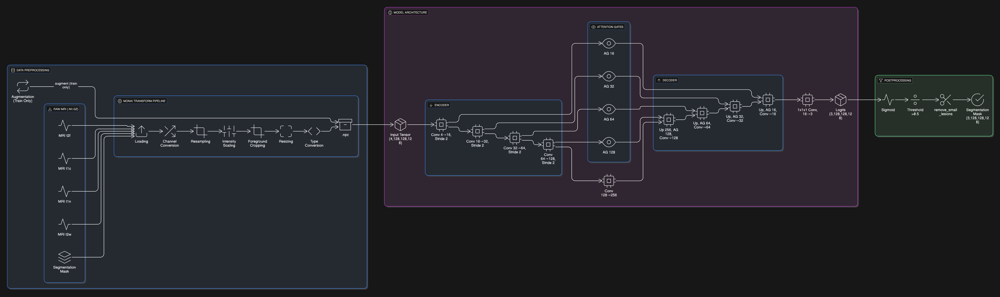

## Milestone 4: Model Training

### Overview and Objective

Milestone 4 centers on the initial training phase of brain tumor segmentation models, utilizing the BraTS 2023 dataset. The primary objective is to experiment with various hyperparameters, optimization strategies, and regularization techniques to achieve stable convergence and enhance segmentation accuracy. All training procedures were executed within the Kaggle environment.

### Dataset Details

The foundation for model training in this phase is the BraTS 2023 dataset, which provides multi-modal MRI scans, specifically T1, T2, FLAIR, and T1ce modalities, tailored for brain tumor segmentation tasks. Following official guidelines, the data is divided into training, validation, and test sets. Preprocessing involved several steps: ConvertToMultiChannelBasedOnBratsClassesd, intensity normalization, resampling, and cropping to a fixed resolution, ensuring the dataset is suitable for model input.

### Model Architecture

The model chosen for this milestone is an Attention U-Net built with the MONAI framework. Attention gates within the network help concentrate on the most relevant spatial features during the upsampling process. The model accepts 4-channel MRI input volumes and generates 3-class segmentation masks that correspond to distinct tumor subregions: whole tumor (WT), tumor core (TC), and enhancing tumor (ET).

- **spatial_dims=3**: Handles 3D image data.
- **in_channels=4**: Represents the four MRI modalities.
- **out_channels=3**: Segmentation masks for the three tumor subregions.
- **channels=(16, 32, 64, 128, 256)**: Number of channels at each U-Net encoder level.
- **strides=(2, 2, 2, 2)**: Stride values for downsampling convolutions.
- **Input Shape**: (Batch Size, 4, 128, 128, 128)
- **Output Shape**: (Batch Size, 3, 128, 128, 128)

### Training Setup

#### Loss Functions and Evaluation Metrics

The loss function used combines Dice Loss and Binary Cross-Entropy with Logits Loss (DiceBCELoss). This hybrid approach is effective for semantic segmentation, particularly when handling imbalanced classes. The main evaluation metric is the Dice Score, which quantifies the overlap between predicted and ground truth segmentation masks. Dice scores are calculated for each tumor subregion and then averaged.

#### Optimizer and Learning Rate Schedules

The AdamW optimizer, a variant of Adam with improved weight decay, was employed. A polynomial learning rate schedule (LambdaLR) was used to gradually decrease the learning rate over epochs.

#### Training Parameters

- **Batch Size**: 2
- **Number of Epochs**: 20, with additional sets of 30 and 40 epochs to further refine the model
- **Early Stopping**: Implemented with a patience of 7 epochs; training is halted if the validation Dice score fails to improve for 7 consecutive epochs.
- **Hardware**: Training performed on a GPU P100.

### Model Summary

#### Specific Training Strategies

Automatic mixed-precision (AMP) training was utilized through `torch.cuda.amp.autocast` and `GradScaler`, accelerating training and reducing memory usage.

### Hyperparameter Experiments

| Hyperparameter      | Values Explored | Best Value |
|---------------------|-----------------|------------|
| Learning Rate       | 1e-4            | 1e-4       |
| Batch Size          | 2               | 2          |
| Additional Epochs   | 40              | 40         |
| Patience            | 28              | 28         |

These hyperparameters provide stable training, with the learning rate of 1e-4 and AdamW optimizer supporting effective convergence. The batch size of 2 is a common choice for 3D medical image segmentation due to GPU memory limitations.

### Regularization and Optimization Techniques

#### Data Augmentation

To mitigate overfitting and enhance generalization, the following MONAI Rand transforms were applied:

- **RandFlipd**: Random flipping along spatial axes
- **RandRotate90d**: Random 90-degree rotations
- **RandScaleIntensityd**: Random intensity scaling
- **Rand3DElasticd**: Random 3D elastic deformations

#### Dropout and Weight Decay

The Attention U-Net architecture may internally utilize dropout, and the AdamW optimizer introduces improved weight decay for regularization.

#### Normalization

`ScaleIntensityRanged` normalization was applied to MRI scans, which is essential for maintaining stability and performance in neural networks.

### Initial Training Results

#### Training and Validation Curves

The plot shows a typical training process where the training loss decreases significantly, while the validation loss initially decreases and later fluctuates, indicating potential overfitting after a certain point. The saved checkpoints reflect attempts to preserve the model’s best state during the training process.

### Observed Behavior

Training proceeded as expected, with the model learning to segment tumor regions effectively. Data augmentation and a robust loss function helped minimize overfitting. Early stopping ensured that training concluded when validation performance plateaued.

### Model Artifacts

The best-performing model, determined by the validation Dice score, was saved as `best_model_fold_0_newsb1,2,3,4,5.pth` as we kept training it.

### Observations and Notes for Next Milestone

#### Early Indications of Model Performance

Initial results are promising, with the model achieving a reasonable Dice score on the validation set. Qualitative visualizations confirm that the model is learning to distinguish different tumor subregions.

#### Issues or Unexpected Behavior

No significant issues were encountered during the initial training phase. During a small train-test, a Dice score of 0.9 was achieved; however, further analysis revealed "background of the image" was affecting the Dice calculation. The Kfold model was also tested, but the no-fold version performed better, so we continued with no fold version.

#### Ideas for Further Tuning or Improvements

- **Hyperparameter Tuning**: Future work may include a more systematic search for optimal learning rates, batch sizes, and other parameters.
- **Model Architecture**: Testing alternative architectures, such as Swin UNETR, or different methods like training each class individually and then using them as an ensemble.
- **Post-processing**: Refining post-processing steps, like removing small, disconnected predicted regions, to improve segmentation accuracy.
- **Ensemble Methods**: Combining predictions from multiple models trained with different initializations or data folds could enhance performance.
- **Error Analysis**: Conducting a deeper error analysis on the validation set to identify and address specific model shortcomings.

