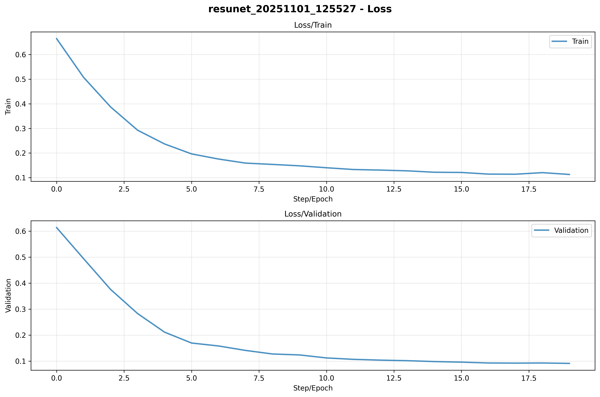
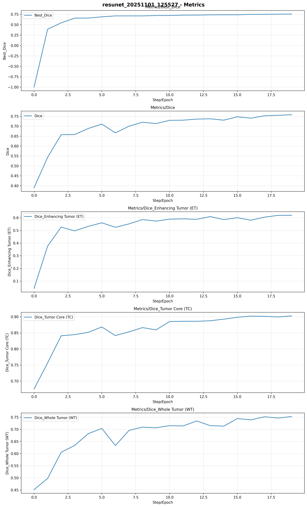
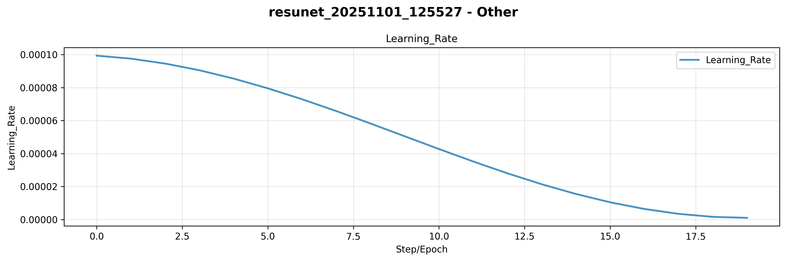

### Model Architecture

The primary model chosen for this milestone is **ResUNet (SegResNet)** built with the MONAI framework. ResUNet combines residual connections with a U-Net architecture, providing improved gradient flow and feature representation for 3D medical image segmentation. The model accepts 4-channel MRI input volumes and generates 3-class segmentation masks that correspond to distinct tumor subregions: whole tumor (WT), tumor core (TC), and enhancing tumor (ET).

#### ResUNet (SegResNet) Architecture Specifications

- **Framework**: MONAI SegResNet
- **spatial_dims**: 3 (Handles 3D image data)
- **in_channels**: 4 (Represents the four MRI modalities: T1, T1CE, T2, FLAIR)
- **out_channels**: 3 (Segmentation masks for the three tumor subregions: WT, TC, ET)
- **init_filters**: 16 (Initial number of filters in the first convolutional layer)
- **blocks_down**: (1, 2, 2, 4) (Number of residual blocks in each downsampling level)
- **blocks_up**: (1, 1, 1) (Number of residual blocks in each upsampling level)
- **Input Shape**: (Batch Size, 4, 128, 128, 128)
- **Output Shape**: (Batch Size, 3, 128, 128, 128)

The architecture uses residual connections at each level to facilitate deeper learning and improve gradient flow during backpropagation. The encoder-decoder structure with skip connections enables precise localization of tumor regions across multiple scales.

### Training Setup

#### Loss Functions and Evaluation Metrics

The loss function used combines Dice Loss and Binary Cross-Entropy with Logits Loss (DiceBCELoss). This hybrid approach is effective for semantic segmentation, particularly when handling imbalanced classes. The loss weighting is balanced:
- **Dice Loss Weight**: 0.5
- **BCE Loss Weight**: 0.5

The main evaluation metric is the Dice Score, which quantifies the overlap between predicted and ground truth segmentation masks. Dice scores are calculated for each tumor subregion (WT, TC, ET) and then averaged to provide the mean Dice score.

#### Optimizer and Learning Rate Schedules

The **AdamW optimizer**, a variant of Adam with improved weight decay regularization, was employed:
- **Learning Rate**: 1e-4 (default, with hyperparameter tuning exploring 1e-4, 5e-4, 1e-3)
- **Weight Decay**: 1e-5 (default, with tuning exploring 1e-5, 1e-4, 1e-3)

A **CosineAnnealingLR** learning rate schedule was used to gradually decrease the learning rate over epochs, with a minimum learning rate (eta_min) of 1e-6.

#### Training Parameters

- **Batch Size**: 1 (constrained by GPU memory for 3D volumes)
- **Number of Epochs**: 20 (initial training), with hyperparameter tuning experiments
- **Early Stopping**: Implemented with a patience of 20 epochs; training is halted if the validation Dice score fails to improve for 20 consecutive epochs
- **Gradient Clipping**: Enabled with max_norm=1.0 to prevent gradient explosion
- **Mixed Precision Training**: AMP (Automatic Mixed Precision) enabled to accelerate training and reduce memory usage
- **Hardware**: Training performed on GPU (RTX 4070 or equivalent)

### Hyperparameter Experiments

A systematic hyperparameter search was conducted for ResUNet, exploring key architectural and training parameters:

| Hyperparameter      | Values Explored | Baseline/Default |
|---------------------|-----------------|------------------|
| Learning Rate       | 1e-4, 5e-4, 1e-3 | 1e-4             |
| Weight Decay        | 1e-5, 1e-4, 1e-3 | 1e-5             |
| Initial Filters     | 8, 16, 32       | 16               |
| Blocks Down         | (1,1,2,4), (1,2,2,4), (1,2,3,4) | (1,2,2,4) |
| Blocks Up           | (1,1,1), (1,2,1), (2,1,1) | (1,1,1) |
| Dice/BCE Loss Weight | (0.3,0.7), (0.5,0.5), (0.7,0.3) | (0.5,0.5) |

These hyperparameters provide stable training, with the baseline configuration (lr=1e-4, init_filters=16, blocks_down=(1,2,2,4), blocks_up=(1,1,1)) serving as the starting point for optimization. The batch size of 1 is a common choice for 3D medical image segmentation due to GPU memory limitations.

### Regularization and Optimization Techniques

#### Data Augmentation

To mitigate overfitting and enhance generalization, the following MONAI Rand transforms were applied:

- **RandFlipd**: Random flipping along spatial axes
- **RandRotate90d**: Random 90-degree rotations
- **RandScaleIntensityd**: Random intensity scaling
- **Rand3DElasticd**: Random 3D elastic deformations

#### Weight Decay and Gradient Clipping

The AdamW optimizer introduces improved weight decay for regularization, set to 1e-5 by default. Gradient clipping (max_norm=1.0) prevents gradient explosion during training, especially important for deeper architectures.

#### Normalization

`ScaleIntensityRanged` normalization was applied to MRI scans, which is essential for maintaining stability and performance in neural networks.

### Training Visualization and Monitoring

Training progress was monitored using TensorBoard, which logs metrics at each epoch:

#### Training Metrics Logged

- **Loss/Train**: Training loss per epoch
- **Loss/Validation**: Validation loss per epoch
- **Metrics/Dice**: Mean Dice score
- **Metrics/Best_Dice**: Best Dice score achieved so far
- **Metrics/Dice_WT**: Dice score for Whole Tumor
- **Metrics/Dice_TC**: Dice score for Tumor Core
- **Metrics/Dice_ET**: Dice score for Enhancing Tumor
- **Learning_Rate**: Current learning rate value

*Figure 1: Training and validation loss curves showing model convergence during training. The training loss decreases steadily while validation loss shows the model's generalization performance.*

*Figure 2: Dice score progression across epochs for mean Dice score and per-class scores (WT, TC, ET). Shows the model's segmentation accuracy improvement over time.*

*Figure 3: Learning rate schedule showing the cosine annealing decay pattern. The learning rate gradually decreases from the initial value to the minimum value over the training epochs.*

*Figure 4: Shows Overview.*

*Figure 4: Results from hyperparameter tuning experiments showing the impact of different configurations on model performance. Visualizes the relationship between hyperparameters and achieved Dice scores.*

### Initial Training Results

#### Training and Validation Curves

The training process demonstrates stable convergence, with the training loss decreasing significantly and validation loss following a similar trend initially. The per-class Dice scores (WT, TC, ET) show the model's ability to segment different tumor subregions, with whole tumor typically achieving the highest scores due to its larger spatial extent.

### Observed Behavior

Training proceeded as expected, with the ResUNet model learning to segment tumor regions effectively. The residual connections helped maintain gradient flow throughout training, and the balanced DiceBCE loss function provided stable optimization. Data augmentation and regularization techniques helped minimize overfitting, while early stopping ensured efficient training by halting when validation performance plateaued.

### Model Artifacts

The best-performing model, determined by the validation Dice score, was saved with checkpoints:
- **Best Model**: `best_resunet.pth` - Model with highest validation Dice score
- **Latest Model**: `latest_resunet.pth` - Most recent model checkpoint
- **Training History**: `training_history_resunet.json` - Complete training metrics
- **TensorBoard Logs**: Saved in `outputs/logs/tensorboard/resunet_*/` for visualization
