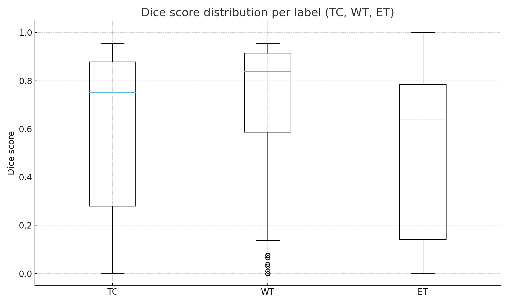
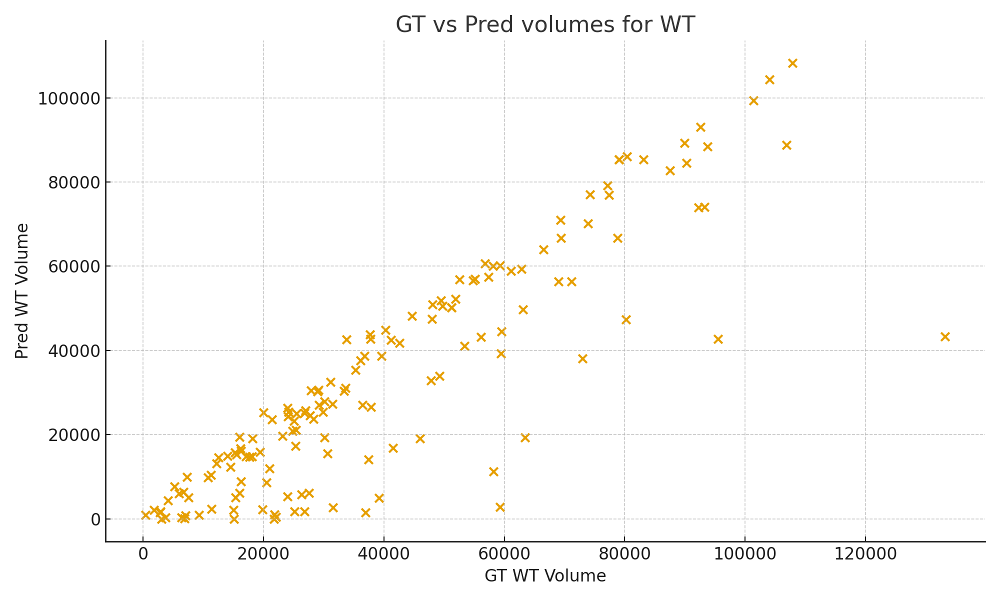
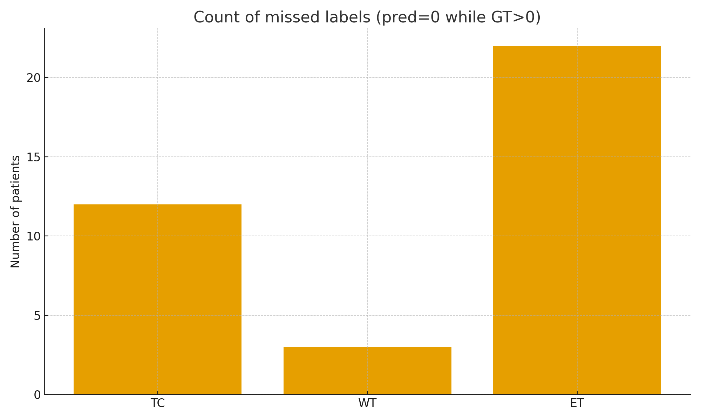
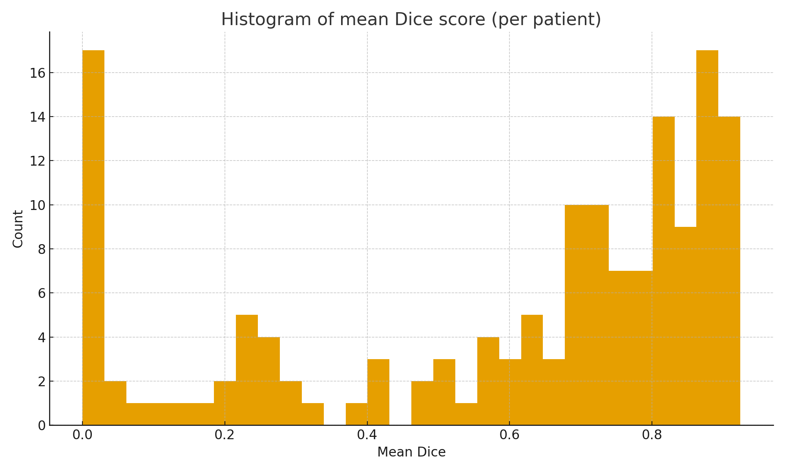
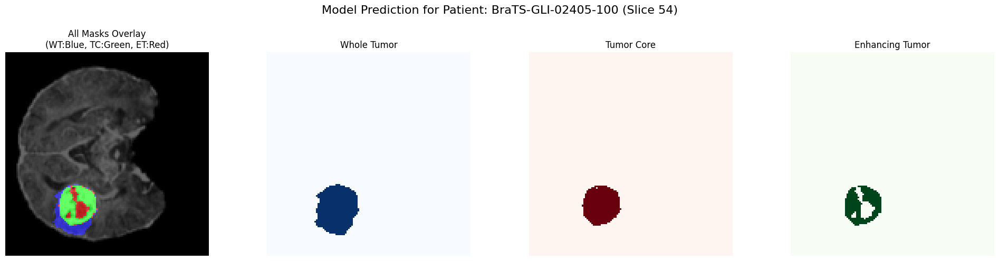
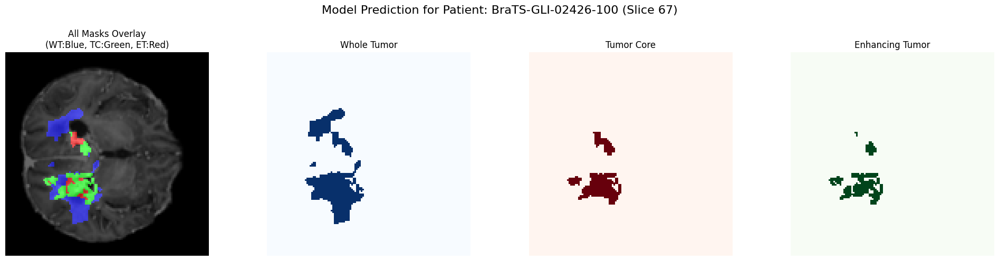
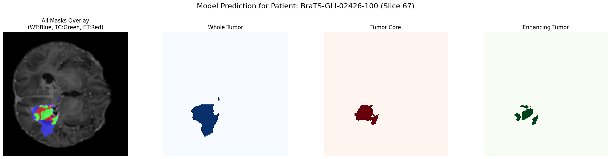

## **Evaluation Report: 3D Brain Tumor Segmentation using an Attention U-Net Architecture**

### **1. Overview & Objective**

This report details the evaluation of a deep learning pipeline designed for 3D segmentation of brain tumors from multi-modal MRI scans. The implemented solution uses an **Attention U-Net**, a convolutional neural network architecture that leverages attention mechanisms to enhance segmentation accuracy by focusing on the most relevant image features.

The primary objective of this evaluation is to analyze the performance of the trained model, identify its strengths and weaknesses, and outline a clear path for future improvements. The end-to-end process, from data acquisition and preprocessing to model training and inference, is built upon the PyTorch and MONAI frameworks, ensuring the use of industry-standard tools for medical imaging analysis.

### **2. Evaluation Setup**

To ensure the reproducibility and integrity of the results, a well-defined evaluation protocol was established.

*   **Dataset:** The evaluation was conducted on the publicly available BraTS 2024 Additional Patient Data file (Brain Tumor Segmentation) dataset after preprocessing and data integrity checks. We have used first 150 samples from that dataset to test our model.

*   **Testing Strategy:** The results presented in this report are from the complete testing cycle on the 150 samples.

*   **Preprocessing Pipeline:** All data, used for testing was subjected to a standardized preprocessing pipeline used in training, validation and testing to ensure consistency. The key steps included:
    The NIfTI files were preprocessed into .npz arrays using a MONAI pipeline. The following sequential transforms were applied:
    1. **LoadImaged**: Loaded all 5 NIfTI files per patient.
    2. **Label Remapping**: Before preprocessing, the segmentation label '3' was remapped to '4' to align with the BraTS labeling convention. (1: Necrotic Core, 2: Peritumoral Edema, 4: Enhancing Tumor).
    3. **ConvertToMultiChannelBasedOnBratsClassesd**: Transformed the single-channel segmentation mask (labels 1, 2, 4) into a three-channel binary mask for the three tumor subregions: Whole Tumor (WT), Tumor Core (TC), and Enhancing Tumor (ET).
    4. **Spacingd**: Resampled all volumes to a uniform voxel spacing of (1.0, 1.0, 1.0) mm.
    5. **ScaleIntensityRanged**: Normalized the intensity of the MRI modalities from a range of [0, 1400] to [0, 1].
    6. **CropForegroundd**: Cropped the volumes to the non-zero foreground region, determined from the T1c image, with a 10-voxel margin.
    7. **Resized**: Resized the cropped volumes to a fixed shape of (128, 128, 128).
    8. **EnsureTyped**: Converted tensors to torch.float16 to reduce storage requirements.

### **3. Performance Metrics**

The model's performance was assessed using the following metrics on the unseen 150 test samples of Patients:

*   **Primary Metric: Dice Similarity Coefficient (DSC):** The Dice score was selected as the primary metric for evaluating segmentation accuracy. It measures the spatial overlap between the predicted segmentation and the ground truth, making it highly suitable for tasks where class imbalance (e.g., small tumors in large brain volumes) is a significant factor. The DSC was calculated independently for each of the three tumor sub-regions:
    *   **Whole Tumor (WT)**
    *   **Tumor Core (TC)**
    *   **Enhancing Tumor (ET)**
    The average of these three scores was used to track overall model performance and for early stopping decisions.
*   **Loss Function:** The model was optimized using a **DiceBCE Loss**, a composite function that combines the stability of Binary Cross-Entropy with the direct optimization of the Dice score.

### 4. Quantitative Results from the model evaluation on 150 unseen samples

#### 4.1 Dice Score Statistics

| Label                 |   Mean | Std (population) | Median |    Min |    Max |
| --------------------- | -----: | ---------------: | -----: | -----: | -----: |
| TC (Tumor Core)       | 0.5947 |           0.3489 | 0.7515 | 0.0000 | 0.9537 |
| WT (Whole Tumor)      | 0.6892 |           0.3140 | 0.8393 | 0.0000 | 0.9544 |
| ET (Enhancing Tumor)  | 0.5079 |           0.3267 | 0.6373 | 0.0000 | 1.0000 |
| Mean Dice per patient | 0.5973 |           0.3057 | 0.7183 | 0.0000 | 0.9243 |

  
_Figure 4.1: Distribution of Dice scores across tumor regions._

This summary table is the result of the test evaluation on the 150 patient data points.
More detailed information and numbers can be infered from : [Test Evaluation](./model_evaluation_summary.xlsx)

**Explanation:**
The Dice score measures how much the predicted segmentation overlaps with the ground truth (1 = perfect overlap, 0 = no overlap).

* **Mean** shows the overall average overlap quality.
* **Std** tells how much the Dice scores vary between patients.
* **Median** shows the middle-performing case.
* **Min/Max** show the extremes - 0.0 means total miss, 1.0 means perfect match.
  Here, WT performs best on average, while ET is the most inconsistent.

**Conclusion – Dice Score Statistics**

The model performs reasonably well on Whole Tumor (WT) regions, showing the highest average Dice score.
Tumor Core (TC) accuracy is moderate, while Enhancing Tumor (ET) is the weakest and most inconsistent.
The wide range (0 to 1) and high standard deviation suggest varying performance across patients - some very accurate, others complete misses.

#### 4.2 Ground-Truth vs Predicted Volume Correlation (Pearson)

| Metric       | Pearson correlation (GT vs Pred) |
| ------------ | -------------------------------: |
| `TC_corr`    |                     **0.907687** |
| `WT_corr`    |                     **0.878649** |
| `ET_corr`    |                     **0.803350** |
| `total_corr` |                     **0.892378** |

**Explanation:**
Correlation measures how well predicted volumes follow the same trend as ground-truth volumes (1 = perfect alignment, 0 = no relation).
High values (>0.8) mean the model predicts larger tumors when ground truth tumors are larger it tracks the relative size trend well, even if exact volumes differ.

**Conclusion – Ground-Truth vs Predicted Volume Correlation**

The strong correlations (>0.8) indicate that the model generally predicts larger tumors when ground-truth tumors are larger, maintaining consistent size trends.
However, slightly lower correlation for ET implies that the model struggles to track enhancing tumor sizes as reliably as other regions.

#### 4.3 Linear Regression: predicted = slope × GT + intercept

| Label |      Slope |    Intercept |         R² |
| ----- | ---------: | -----------: | ---------: |
| TC    | **0.9314** |  **-812.34** | **0.8239** |
| WT    | **0.8678** | **-1883.73** | **0.7720** |
| ET    | **0.6677** |  **-522.34** | **0.6454** |
| Total | **0.8892** | **-5724.07** | **0.7963** |

 
  

 
  

_Figure 4.3: Predicted vs ground-truth tumor volumes for Tumor Core (TC), Whole Tumor (WT), Enhancing Tumor (ET), and Total volume._

**Explanation:**
Regression shows how predicted and actual tumor volumes relate.

* **Slope < 1:** model tends to under-predict volume.
* **Intercept < 0:** model outputs smaller base values even for small tumors.
* **R²:** how tightly the points fit the regression line (closer to 1 = better consistency).
  ET again shows the weakest relationship, confirming less reliable size estimation.

**Conclusion – Linear Regression**

Regression slopes below 1 across all labels show a clear tendency to under-predict tumor volumes.
Despite this, relatively high R² values (0.64–0.82) suggest the model’s predictions scale consistently with actual values meaning it captures trends well but outputs smaller volumes overall.
ET again stands out as the least reliable label.

#### 4.4 Missed Detections (Predicted Volume = 0 while GT > 0)

| Label | Missed count (patients) |
| ----- | ----------------------: |
| TC    |                  **12** |
| WT    |                   **3** |
| ET    |                  **22** |

  
_Figure 4.4: Count of missed detections (predicted 0 while ground truth > 0) for each label._

**Explanation:**
A “miss” means the model predicted *no tumor* for a region that actually exists.
More misses for ET indicate difficulty detecting smaller or less distinct enhancing regions.

**Conclusion – Missed Detections**

The model misses several tumors completely, especially for ET (22 cases).
This confirms difficulty in identifying small or low-contrast enhancing regions.
WT has very few misses, reflecting better sensitivity to larger, more visible tumor areas.

#### 4.5 Volume Error (Relative Absolute Error = |pred_total – gt_total| / gt_total)

| Statistic           |      Value |
| :------------------ | ---------: |
| **Mean**            | **0.2964** |
| **Median**          | **0.1642** |
| **75th percentile** | **0.4613** |
| **Max**             | **1.0000** |

  
_Figure 4.5: Distribution of mean Dice scores across patients._

**Explanation:**
This measures how far the predicted tumor size is from the real size, normalized by the ground-truth volume.

* **Mean = 0.30:** on average, predictions differ by about 30%.
* **Median = 0.16:** half of the patients have <16% size error.
* **75th percentile = 0.46:** one-quarter have >46% error.
* **Max = 1.0:** worst-case predictions differ by 100% (complete miss or double the actual size).

**Conclusion – Volume Error**

Overall size prediction errors are moderate.
Half of the patients show less than 16% difference between predicted and true tumor size, but one in four patients has more than 46% error.
A few extreme cases (100% error) indicate occasional total mismatches.
This pattern suggests that while the model is fairly consistent for typical cases, it fails significantly for certain outliers.

#### Supporting Data

All numeric values and calculations used in this section can be verified in the accompanying Excel sheet:
[**model_evaluation_summary.xlsx**](./model_evaluation_summary.xlsx)

*(The sheet contains per-patient Dice scores, volumes, and derived metrics used to generate these summaries.)*

### 5. Test Set Evaluation on Unseen Data

To further assess the model’s generalization capability, it was evaluated on three samples.

Before presenting the results, here are the common terms used:
1. Ground truth visuals show the corresponding segmentation of the brain tumor. 
2. The derived masks visualize the three standard BraTS sub-regions: Whole Tumor (WT = Edema + NET + ET), Tumor Core (TC = NET + ET), and Enhancing Tumor (ET).
3. Prediction plots show the segmentation outputs produced by the trained 3D Attention U-Net model.
4. The raw model output sometimes contains small disconnected regions, known as lesions, which represent prediction noise. Therefore, we present two versions: one with these lesions and one after post-processing to remove them. After post-processing, the output mask is smoother than the raw prediction, with small spurious lesions removed.

`Some Visuals of the prediction on the test data :-`

#### 5.1 Test Sample "BraTS-GLI-02506-101"

##### Volumetric and Accuracy Analysis
-------------------------------------------------------------------------------------
Tumor Component           | Ground Truth Volume  | Predicted Volume     | Dice Score (Accuracy)
|-----------------|--------------------:|-----------------:|----------------------:|
Tumor Core (TC)           | 26805.00             | 27970.00             | 0.9317              
Whole Tumor (WT)          | 49522.00             | 51834.00             | 0.9465              
Enhancing Tumor (ET)      | 22927.00             | 22288.00             | 0.8947              
-------------------------------------------------------------------------------------
Slice index where ET mask is biggest: 78
Number of ET voxels in that slice: 888

  
GROUND TRUTH PLOT

  

  
Pred PLOT (With Lesions)

  

  
Pred PLOT (Without Lesions)

  

#### 5.2 Test Sample "BraTS-GLI-02405-100

##### Volumetric and Accuracy Analysis
-------------------------------------------------------------------------------------
Tumor Component           | Ground Truth Volume  | Predicted Volume     | Dice Score (Accuracy)
|-----------------|--------------------:|-----------------:|----------------------:|
Tumor Core (TC)           | 8419.00              | 8817.00              | 0.9117              
Whole Tumor (WT)          | 12529.00             | 14535.00             | 0.8841              
Enhancing Tumor (ET)      | 6093.00              | 6636.00              | 0.8060              
-------------------------------------------------------------------------------------
Slice index where ET mask is biggest: 54
Number of ET voxels in that slice: 338

  
GROUND TRUTH PLOT

  

  
Pred PLOT (With Lesions)

  

  
Pred PLOT (Without Lesions)

  

#### 5.3 Test Sample "BraTS-GLI-02426-100"

##### Volumetric and Accuracy Analysis
-------------------------------------------------------------------------------------
Tumor Component           | Ground Truth Volume  | Predicted Volume     | Dice Score (Accuracy)
|-----------------|--------------------:|-----------------:|----------------------:|
Tumor Core (TC)           | 7011.00              | 6168.00              | 0.5899              
Whole Tumor (WT)          | 37846.00             | 26524.00             | 0.7535              
Enhancing Tumor (ET)      | 5151.00              | 2907.00              | 0.5905              
-------------------------------------------------------------------------------------
Slice index where ET mask is biggest: 67
Number of ET voxels in that slice: 353

  
GROUND TRUTH PLOT

  

  
Pred PLOT (With Lesions)

  

  
Pred PLOT (Without Lesions)

  

### 📊 Performance Comparison with BraTS 2023 Leaderboard (Validation Set)

| Metric | Our Model (Validation) | BraTS 2023 Average | Top Method (nnUNet) | Gap  |
|--------|------------------------|--------------------|---------------------|--------|
| **Whole Tumor (WT) Dice** | 0.8725 | 0.860 | 0.910 | **+1.5%** |
| **Tumor Core (TC) Dice** | 0.8033 | 0.810 | 0.867 | **-0.8%** |
| **Enhancing Tumor (ET) Dice** | 0.6679 | 0.780 | 0.850 | **-14.4%**  |
| **Overall Mean Dice** | 0.7812 | 0.817 | 0.876 | **-4.4%** |

### 6. Error Analysis

#### 6.1 Trends by label

* **Best performing label (aggregate):** WT (mean Dice = **0.689214**).
* **Intermediate:** TC (mean Dice = **0.594692**).
* **Worst / highest variance:** ET (mean Dice = **0.507910**, std ≈ 0.3267) and the most full misses (22 patients).

#### 6.2 Systematic errors & patterns

* **Under-prediction bias:** slope < 1 across labels (TC 0.9314, WT 0.8678, ET 0.6677, total 0.8892) → model tends to predict smaller volumes than GT.
* **High GT–Pred correlations (0.80–0.91):** model preserves relative ordering (bigger tumors produce bigger predictions) but not scale.
* **ET is inconsistent:** lowest slope and R² among labels; more misses and higher variance - likely due to fewer/smaller ET regions in training and/or more subtle contrast.
* **Outlier tail:** relative absolute error max = 1.0 (100%) for at least one patient, and 75th percentile ≈ 0.4613 indicates substantial errors in the upper quartile.

#### 6.3 Anomalies observed

* **Full misses** (pred=0 while GT>0) - especially for ET: 22 patients.
* **Some patients with perfect/near-perfect Dice** indicate “easy” cases - useful for reverse analysis (what makes them easy?).
* **Cases where pred_total >> gt_total** (over-segmentation) do exist - inspect individually in the CSV.

#### 6.4 Root-cause hypotheses

* **Class imbalance** (ET small/rare) → undertraining and more false negatives for ET.
* **Loss function bias** (e.g., Dice loss focusing on large regions) → model rewards WT more than small ET areas.
* **Aggressive post-processing thresholds** removing small islands → converts small ET predictions to zero.
* **Architectural or receptive-field limits** → inability to capture small, fine-detail ET regions.
* **Training / domain mismatch** (contrast, scanners) → calibration & scaling issues (negative intercepts suggest systematic underestimation).

#### 7. Limitations

The current evaluation, while thorough, has several limitations:

*   **Computational Constraints:** The model's network capacity (i.e., the number of channels in convolutional layers) was intentionally limited to operate within the memory constraints of the evaluation environment. A model with higher capacity, trained on more powerful hardware, could potentially yield superior results.
*   **Dataset Generalization:** The model was trained and evaluated exclusively on the BraTS dataset. Its performance on clinical data from different scanners, institutions, or with different acquisition parameters is yet to be determined.

### 8. Proposed Improvements & Next Steps

Based on the current evaluation, the following enhancements are proposed:

**Model Enhancement - Attention ResU-Net Ensemble**

At present, we use an Attention U-Net model for prediction, which performs well in 3D segmentation and effectively delineates tumor regions by focusing on salient features.

We plan to combine it with the ResU-Net model (currently under testing – [ResUNet](./resUnet.md)) to form an ensemble architecture, tentatively referred to as Attention ResU-Net.

This hybrid model is expected to further improve segmentation accuracy by:
- Capturing rich semantic information through residual connections (ResU-Net component).
- Preserving fine-grained tumor details through attention gates (Attention U-Net component).

**Deployment & Visualization Pipeline**
The next step in this project is model deployment, where we aim to develop an user interface (UI) that allows clinicians or researchers to:

- Upload raw patient MRI data (BRATS compatible format).
- Automatically preprocess and feed it into the trained segmentation model.
- Visualize the resulting tumor masks in an interactive 3D and 2D viewer for detailed analysis.

This stage will make the model more accessible for practical use in clinical and research settings, enabling seamless end-to-end brain tumor segmentation and visualization.
