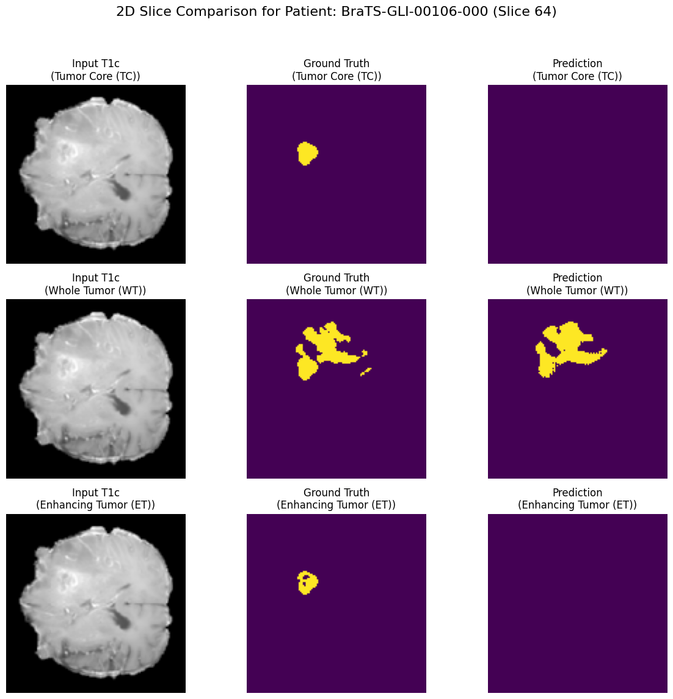
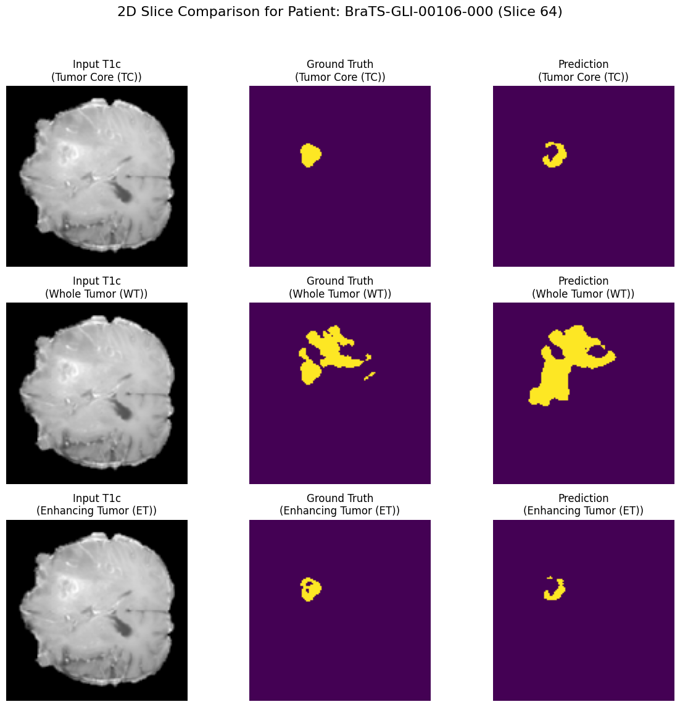
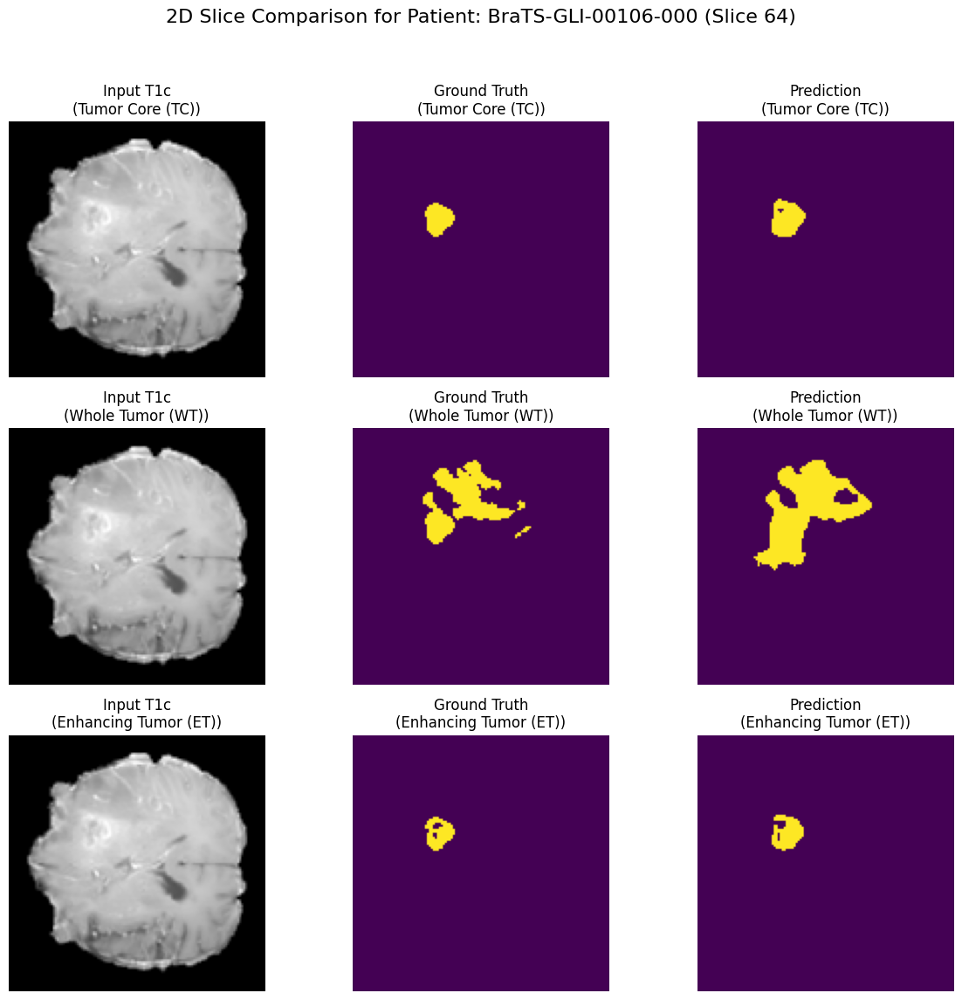

### **Evaluation Report: 3D Brain Tumor Segmentation using an Attention U-Net Architecture**

#### **1. Overview & Objective**

This report details the evaluation of a deep learning pipeline designed for 3D segmentation of brain tumors from multi-modal MRI scans. The implemented solution uses an **Attention U-Net**, a convolutional neural network architecture that leverages attention mechanisms to enhance segmentation accuracy by focusing on the most relevant image features.

The primary objective of this evaluation is to analyze the performance of the trained model, identify its strengths and weaknesses, and outline a clear path for future improvements. The end-to-end process, from data acquisition and preprocessing to model training and inference, is built upon the PyTorch and MONAI frameworks, ensuring the use of industry-standard tools for medical imaging analysis.

#### **2. Evaluation Setup**

To ensure the reproducibility and integrity of the results, a well-defined evaluation protocol was established.

*   **Dataset:** The evaluation was conducted on the publicly available BraTS (Brain Tumor Segmentation) dataset. Following a preprocessing and data integrity check.
    The dataset was partitioned using Scikit-learn's KFold with N_SPLITS=5, producing five 80/20 train-validation splits. For this experiment, a single fold (FOLD_TO_RUN = 0) was used, yielding 1000 files for training and 251 for validation. The split was shuffled with a random state of 42 for reproducibility.

*   **Validation Strategy:** The results presented in this report are from the complete training and validation cycle, where 80% of the data was used for training and the remaining 20% for validation.

*   **Preprocessing Pipeline:** All data, for both training and validation, was subjected to a standardized preprocessing pipeline to ensure consistency. The key steps included:
    The NIfTI files were preprocessed into .npz arrays using a MONAI pipeline. The following sequential transforms were applied:
    1. **LoadImaged**: Loaded all 5 NIfTI files per patient.
    2. **Label Remapping**: Before preprocessing, the segmentation label '3' was remapped to '4' to align with the BraTS labeling convention. (1: Necrotic Core, 2: Peritumoral Edema, 4: Enhancing Tumor).
    3. **ConvertToMultiChannelBasedOnBratsClassesd**: Transformed the single-channel segmentation mask (labels 1, 2, 4) into a three-channel binary mask for the three tumor subregions: Whole Tumor (WT), Tumor Core (TC), and Enhancing Tumor (ET).
    4. **Spacingd**: Resampled all volumes to a uniform voxel spacing of (1.0, 1.0, 1.0) mm.
    5. **ScaleIntensityRanged**: Normalized the intensity of the MRI modalities from a range of [0, 1400] to [0, 1].
    6. **CropForegroundd**: Cropped the volumes to the non-zero foreground region, determined from the T1c image, with a 10-voxel margin.
    7. **Resized**: Resized the cropped volumes to a fixed shape of (128, 128, 128).
    8. **EnsureTyped**: Converted tensors to torch.float16 to reduce storage requirements.

#### **3. Performance Metrics**

The model's performance was assessed using the following metrics:

*   **Primary Metric: Dice Similarity Coefficient (DSC):** The Dice score was selected as the primary metric for evaluating segmentation accuracy. It measures the spatial overlap between the predicted segmentation and the ground truth, making it highly suitable for tasks where class imbalance (e.g., small tumors in large brain volumes) is a significant factor. The DSC was calculated independently for each of the three tumor sub-regions:
    *   **Whole Tumor (WT)**
    *   **Tumor Core (TC)**
    *   **Enhancing Tumor (ET)**
    The average of these three scores was used to track overall model performance and for early stopping decisions.
*   **Loss Function:** The model was optimized using a **DiceBCE Loss**, a composite function that combines the stability of Binary Cross-Entropy with the direct optimization of the Dice score.

#### **4. Quantitative Results**

The training process was closely monitored, yielding detailed quantitative insights into model performance. For each epoch, the training loss, validation loss, and the per-class validation Dice scores were logged.

|  Epoch  | Training Loss | Validation Loss | Val Dice (Avg) | Dice (TC) | Dice (WT) | Dice (ET) |
|:-------:|:-------------:|:---------------:|:--------------:|:---------:|:---------:|:---------:|
| 1     ♣ | 0.8234        | 0.8027          | 0.2400         | 0.3400    | 0.3686    | 0.0112    |
| 2     ♣ | 0.7727        | 0.7493          | 0.2808         | 0.3826    | 0.4396    | 0.0202    |
| 3     ♣ | 0.7151        | 0.6900          | 0.3969         | 0.3985    | 0.5784    | 0.2137    |
| 4     ♣ | 0.6601        | 0.6410          | 0.4935         | 0.4852    | 0.6546    | 0.3408    |
| 5     ♣ | 0.6152        | 0.5999          | 0.5334         | 0.5077    | 0.6945    | 0.3980    |
| 6       | 0.5742        | 0.5595          | 0.5259         | 0.5149    | 0.6796    | 0.3832    |
| 7       | 0.5353        | 0.5334          | 0.5123         | 0.4976    | 0.6375    | 0.4018    |
| 8     ♣ | 0.4986        | 0.5371          | 0.5423         | 0.5360    | 0.6505    | 0.4403    |
| 9     ♣ | 0.4630        | 0.4784          | 0.5714         | 0.5355    | 0.7067    | 0.4720    |
| 10    ♣ | 0.4250        | 0.4542          | 0.5863         | 0.5524    | 0.7296    | 0.4770    |
| 11      | 0.3847        | 0.4596          | 0.5788         | 0.5410    | 0.7103    | 0.4851    |
| 12      | 0.3432        | 0.4485          | 0.5626         | 0.5457    | 0.6639    | 0.4782    |
| 13      | 0.3013        | 0.4239          | 0.5703         | 0.5506    | 0.6879    | 0.4723    |
| 14      | 0.2639        | 0.4056          | 0.5583         | 0.5440    | 0.7278    | 0.4029    |
| 15      | 0.2304        | 0.3716          | 0.5863         | 0.5666    | 0.7462    | 0.4461    |
| 16    ♣ | 0.2044        | 0.3473          | 0.6183         | 0.6095    | 0.7431    | 0.5024    |
| 17      | 0.1834        | 0.3618          | 0.5711         | 0.5676    | 0.6876    | 0.4581    |
| 18      | 0.1686        | 0.3481          | 0.5955         | 0.5990    | 0.6887    | 0.4986    |
| 19      | 0.1567        | 0.3276          | 0.6051         | 0.6100    | 0.7107    | 0.4945    |
| 20      | 0.1450        | 0.3604          | 0.5608         | 0.5622    | 0.7023    | 0.4180    |
| 21      | 0.1363        | 0.3973          | 0.5857         | 0.5970    | 0.6821    | 0.4779    |
| 22    ♣ | 0.1315        | 0.3393          | 0.6296         | 0.6250    | 0.7501    | 0.5138    |
| 23    ♣ | 0.1320        | 0.3289          | 0.5641         | 0.5820    | 0.6497    | 0.4605    |
| 24    ♣ | 0.1260        | 0.2887          | 0.6115         | 0.6196    | 0.7248    | 0.4902    |
| 25      | 0.1191        | 0.3005          | 0.5786         | 0.5895    | 0.7321    | 0.4141    |
| 26      | 0.1140        | 0.3064          | 0.5343         | 0.5341    | 0.6884    | 0.3803    |
| 27      | 0.1131        | 0.2979          | 0.6028         | 0.5835    | 0.7357    | 0.4893    |
| 28    ♣ | 0.1114        | 0.2361          | 0.6449         | 0.6606    | 0.7649    | 0.5093    |
| 29      | 0.1103        | 0.2541          | 0.5919         | 0.5963    | 0.7194    | 0.4599    |
| 30      | 0.1033        | 0.2331          | 0.6047         | 0.6146    | 0.7356    | 0.4639    |
| 31      | 0.1036        | 0.2102          | 0.6211         | 0.6372    | 0.7398    | 0.4862    |
| 32      | 0.1048        | 0.3089          | 0.5921         | 0.6034    | 0.6659    | 0.5071    |
| 33    ♣ | 0.0993        | 0.1692          | 0.6608         | 0.6617    | 0.8032    | 0.5175    |
| 34    ♣ | 0.1018        | 0.2514          | 0.6112         | 0.6271    | 0.6831    | 0.5233    |
| 35      | 0.1002        | 0.2812          | 0.5780         | 0.5447    | 0.6954    | 0.4939    |
| 36      | 0.1005        | 0.2489          | 0.5960         | 0.6010    | 0.6694    | 0.5176    |
| 37      | 0.0995        | 0.2208          | 0.5997         | 0.6081    | 0.7247    | 0.4662    |
| 38    ♣ | 0.0995        | 0.1889          | 0.6823         | 0.6971    | 0.7746    | 0.5753    |
| 39      | 0.0966        | 0.2092          | 0.5981         | 0.6135    | 0.7053    | 0.4753    |
| 40      | 0.0944        | 0.1711          | 0.6669         | 0.6822    | 0.7642    | 0.5542    |
| 41      | 0.0964        | 0.2087          | 0.6486         | 0.6615    | 0.7447    | 0.5397    |
| 42      | 0.0941        | 0.1980          | 0.6594         | 0.6826    | 0.7371    | 0.5585    |
| 43      | 0.0938        | 0.2160          | 0.6176         | 0.6534    | 0.6823    | 0.5169    |
| 44      | 0.0915        | 0.1722          | 0.6569         | 0.6595    | 0.7517    | 0.5595    |
| 45      | 0.0912        | 0.1997          | 0.6345         | 0.6326    | 0.7265    | 0.5445    |
| 46      | 0.0904        | 0.1876          | 0.6200         | 0.6447    | 0.7270    | 0.4883    |
| 47      | 0.0906        | 0.2758          | 0.6002         | 0.6359    | 0.6360    | 0.5287    |
| 48      | 0.0900        | 0.1536          | 0.6655         | 0.6653    | 0.7888    | 0.5425    |
| 49      | 0.0915        | 0.1513          | 0.6601         | 0.6733    | 0.7876    | 0.5195    |
| 50      | 0.0875        | 0.2287          | 0.6262         | 0.6415    | 0.6688    | 0.5683    |
| 51      | 0.0875        | 0.1896          | 0.6499         | 0.6680    | 0.7372    | 0.5446    |
| 52      | 0.0864        | 0.2231          | 0.5963         | 0.6250    | 0.6505    | 0.5132    |
| 53      | 0.0892        | 0.1912          | 0.6423         | 0.6493    | 0.7132    | 0.5644    |
| 54      | 0.0842        | 0.1830          | 0.6303         | 0.6631    | 0.7267    | 0.5011    |
| 55    ♣ | 0.0847        | 0.1248          | 0.7023         | 0.7078    | 0.8384    | 0.5608    |
| 56    ♣ | 0.0908        | 0.2104          | 0.6327         | 0.6512    | 0.6710    | 0.5759    |
| 57    ♣ | 0.0887        | 0.1803          | 0.6468         | 0.6693    | 0.7474    | 0.5237    |
| 58    ♣ | 0.0866        | 0.1977          | 0.6509         | 0.6720    | 0.7272    | 0.5536    |
| 59      | 0.0872        | 0.1872          | 0.6350         | 0.6361    | 0.7333    | 0.5355    |
| 60      | 0.0867        | 0.1989          | 0.6368         | 0.6545    | 0.6900    | 0.5660    |
| 61      | 0.0837        | 0.1882          | 0.6391         | 0.6270    | 0.7252    | 0.5652    |
| 62    ♣ | 0.0847        | 0.1310          | 0.7176         | 0.7293    | 0.8201    | 0.6034    |
| 63      | 0.0845        | 0.1325          | 0.6945         | 0.6875    | 0.8229    | 0.5730    |
| 64      | 0.0842        | 0.1716          | 0.6684         | 0.6884    | 0.7550    | 0.5619    |
| 65      | 0.0829        | 0.2281          | 0.5943         | 0.5852    | 0.6335    | 0.5641    |
| 66    ♣ | 0.0856        | 0.1482          | 0.7196         | 0.7425    | 0.7950    | 0.6212    |
| 67    ♣ | 0.0807        | 0.1053          | 0.7590         | 0.7788    | 0.8554    | 0.6428    |
| 68    ♣ | 0.0806        | 0.1924          | 0.6352         | 0.6336    | 0.7075    | 0.5644    |
| 69    ♣ | 0.0829        | 0.1573          | 0.6761         | 0.6887    | 0.7716    | 0.5680    |
| 70    ♣ | 0.0823        | 0.1483          | 0.6918         | 0.7037    | 0.7927    | 0.5790    |
| 71      | 0.0815        | 0.2471          | 0.5753         | 0.6259    | 0.6088    | 0.4911    |
| 72    ♣ | 0.0844        | 0.1294          | 0.7033         | 0.6910    | 0.8384    | 0.5806    |
| 73      | 0.0820        | 0.1392          | 0.6991         | 0.7261    | 0.8047    | 0.5665    |
| 74      | 0.0800        | 0.1490          | 0.6864         | 0.7100    | 0.7794    | 0.5699    |
| 75      | 0.0821        | 0.1495          | 0.6834         | 0.7102    | 0.8129    | 0.5270    |
| 76    ♣ | 0.0815        | 0.1241          | 0.7388         | 0.7566    | 0.8232    | 0.6366    |
| 77      | 0.0789        | 0.1300          | 0.7149         | 0.7181    | 0.8240    | 0.6027    |
| 78      | 0.0788        | 0.1476          | 0.7046         | 0.7351    | 0.7874    | 0.5913    |
| 79      | 0.0796        | 0.1114          | 0.7360         | 0.7628    | 0.8524    | 0.5928    |
| 80      | 0.0782        | 0.2144          | 0.6142         | 0.6337    | 0.6616    | 0.5472    |
| 81      | 0.0776        | 0.1320          | 0.7091         | 0.7210    | 0.8204    | 0.5860    |
| 82      | 0.0783        | 0.1528          | 0.6929         | 0.7233    | 0.7638    | 0.5916    |
| 83      | 0.0787        | 0.1159          | 0.7370         | 0.7497    | 0.8391    | 0.6221    |
| 84      | 0.0758        | 0.1656          | 0.6635         | 0.6641    | 0.7611    | 0.5653    |
| 85      | 0.0763        | 0.1160          | 0.7370         | 0.7663    | 0.8405    | 0.6044    |
| 86      | 0.0774        | 0.1486          | 0.6911         | 0.6944    | 0.7956    | 0.5832    |
| 87      | 0.0776        | 0.2000          | 0.6247         | 0.6444    | 0.6808    | 0.5489    |
| 88      | 0.0760        | 0.1475          | 0.6866         | 0.7040    | 0.7876    | 0.5684    |
| 89      | 0.0757        | 0.1199          | 0.7291         | 0.7468    | 0.8285    | 0.6120    |
| 90      | 0.0768        | 0.2231          | 0.6090         | 0.6381    | 0.6405    | 0.5484    |
| 91      | 0.0742        | 0.2164          | 0.5909         | 0.6004    | 0.6818    | 0.4903    |
| 92      | 0.0745        | 0.1809          | 0.6776         | 0.7152    | 0.7362    | 0.5815    |
| 93    ♣ | 0.0756        | 0.0957          | 0.7812         | 0.8033    | 0.8725    | 0.6679    |

The model's performance progressively improved, with the average validation Dice score serving as the key indicator for saving the best model weights. An early stopping mechanism with a patience of 7 epochs was implemented, halting the training if the average Dice score on the validation set did not improve, thereby preventing overfitting. The final saved model represents the state with the highest achieved validation Dice score.

#### **5. Qualitative Results**

Qualitative analysis was performed by visualizing the model's predictions on samples from the validation set. This involved generating side-by-side comparisons of the input MRI, the ground truth segmentation mask, and the model's predicted output for each tumor sub-region.

  
Epoch 22

  

  
Epoch 33

  

  
Epoch 55

  

  
Epoch 67

  

  
Epoch 93

  

These visualizations confirm that the model is capable of accurately identifying and delineating the different tumor components. They also serve as a crucial tool for diagnosing specific failure modes, such as the over- or under-segmentation of certain tumor boundaries.

#### **6. Error Analysis**

A detailed analysis of the model's outputs revealed several key trends and systematic errors:

*   **Systematic Errors:** The raw model output occasionally included small, disconnected regions of prediction that were not anatomically plausible (false positives). To address this, a post-processing step was implemented to **remove small, spurious lesions**. This function filters out any predicted components below a predefined voxel size threshold for each tumor class, significantly cleaning the final output mask and improving its clinical relevance.
*   **Per-Class Performance:** Consistent with findings in related literature, the model achieved the highest Dice scores on the Whole Tumor (WT) and the lowest on the Enhancing Tumor (ET). This is attributed to the fact that the ET is often the smallest and most variable of the sub-regions, making it inherently more challenging to segment accurately.

#### **7. Limitations**

The current evaluation, while thorough, has several limitations:

*   **Computational Constraints:** The model's network capacity (i.e., the number of channels in convolutional layers) was intentionally limited to operate within the memory constraints of the evaluation environment. A model with higher capacity, trained on more powerful hardware, could potentially yield superior results.
*   **Dataset Generalization:** The model was trained and evaluated exclusively on the BraTS dataset. Its performance on clinical data from different scanners, institutions, or with different acquisition parameters is yet to be determined.

#### **8. Proposed Improvements & Next Steps**

Based on this evaluation, the following steps are recommended for future work:

1.
2.
3.