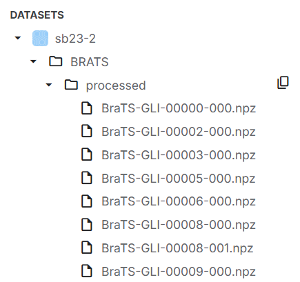
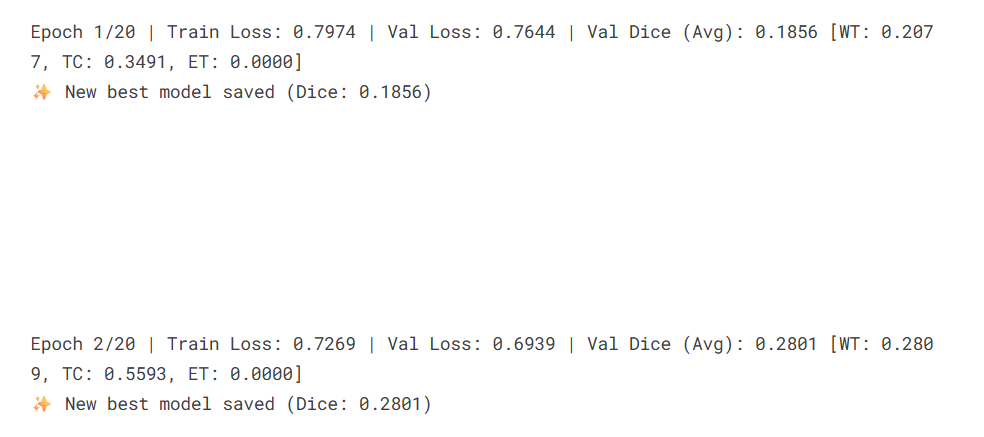
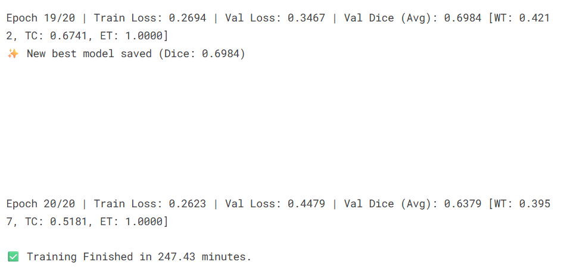
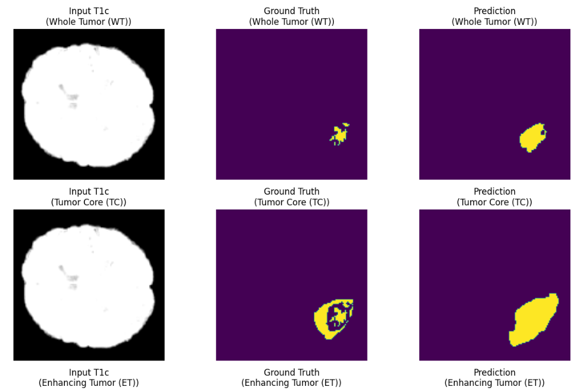
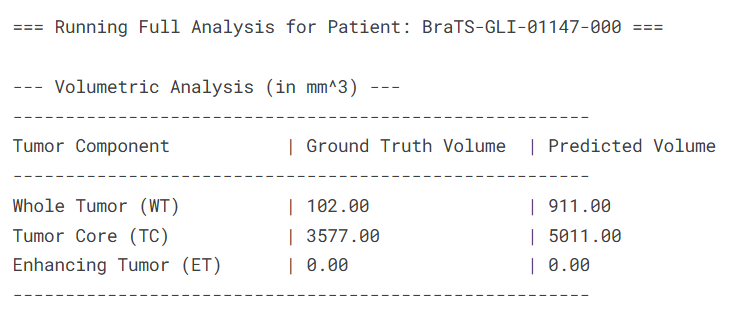
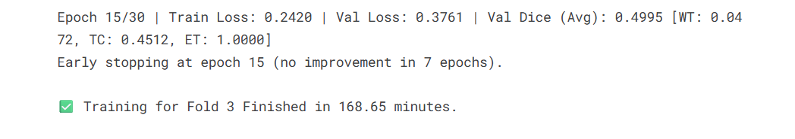
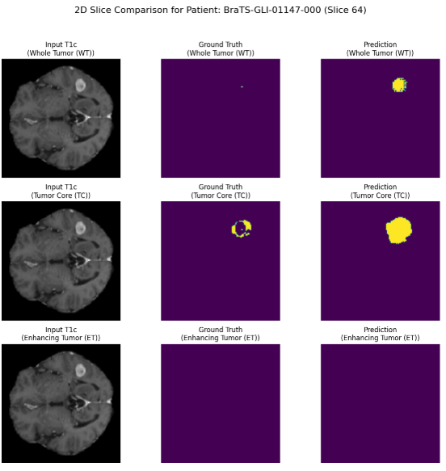
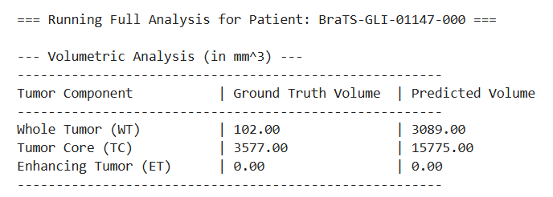
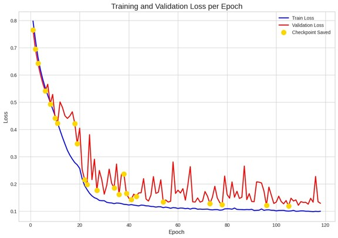

# Project ORCA  
### Deep Learning for Automated Brain Tumor Segmentation  
**Group-8-DS-and-AI-Lab-Project**  

---

## Abstract

**Project ORCA** presents a deep learning–based approach for **automated brain tumor segmentation** using **multi-modal MRI data**.  
Manual delineation of tumors is time-consuming and prone to subjective variation among radiologists.  
This project builds an **Attention U-Net–based model** that automatically segments three tumor subregions — enhancing tumor, tumor core, and whole tumor — with strong generalization capability.

Our approach combines **3D patch-based preprocessing**, **attention-driven feature learning**, and **cross-validation training** to achieve accurate and reproducible segmentation results.  

## Problem Statement (Milestone 1)

Brain tumor segmentation from MRI scans is crucial for diagnosis and treatment planning but is still performed manually — a process that’s **slow and subjective**.  
**Project ORCA** aims to develop a **deep learning–based automated segmentation model** using the **BraTS dataset**, focusing on accurately identifying tumor sub-regions (enhancing tumor, core, edema) from multi-modal MRI (T1, T1ce, T2, FLAIR).

**Objectives**
- Automate brain tumor segmentation with deep learning.  
- Leverage multi-modal MRI for robust predictions.  
- Generate quantitative tumor volume outputs.  
- Prototype a report generator for clinical interpretation.

<p align="center">
  <br>
  <em>MRI modalities in BraTS dataset</em>
</p>

**Chosen Approach**  
After reviewing U-Net, DeepMedic, V-Net, and Transformer-based methods, we selected **Attention U-Net** for its ability to focus on relevant tumor regions through attention gating.

**Evaluation Metrics:** Dice Similarity Coefficient (DSC).

## Dataset & Preprocessing (Milestone 2)

We use the **BraTS 2023 Dataset** — the global benchmark for brain tumor segmentation — containing 3D multi-modal MRI scans (T1, T1c, T2, FLAIR) and expert-annotated segmentation masks.

**Why BraTS?**  
- Clinically relevant and multi-institutional  
- High-quality expert annotations  
- Publicly available (CC BY-NC 4.0) for academic use  
- Standard benchmark for comparing medical AI models  

> Data source: [Synapse ID – syn51156910](https://www.synapse.org/#!Synapse:syn51156910)  
> Processed dataset hosted at: [Kaggle – sb23-2](https://www.kaggle.com/datasets/siddhantbapna/sb23-2/data)

### Exploratory Data Analysis
EDA revealed:
- Consistent 3D dimensions (`240×240×155`) and voxel spacing `(1.0, 1.0, 1.0)`  
- Variable intensity ranges → required normalization  
- Tumor sub-regions not always present in each case  
- Correct mask–image alignment verified visually

**Notebooks:**

* [EDA – brats2023.ipynb](./Milestone-2/eda-brats2023.ipynb)
* [EDA – 3D patches.ipynb](./Milestone-2/eda-brats2023_3D-patches.ipynb)
* [EDA – with 3D view.ipynb](./Milestone-2/eda-brats2023_with_3d.ipynb)

### Preprocessing Pipeline
Implemented using **MONAI** for robust medical image handling.

Steps:
1. Load `.nii.gz` MRI volumes (T1, T1c, T2, FLAIR, seg)  
2. Normalize intensity to [0 – 1]  
3. Crop non-brain background  
4. Resize to `(128×128×128)`  
5. Convert segmentation masks to multi-channel format  
6. Save processed tensors as compressed `.npz` files  

Parallelized CPU processing ensures fast execution and automatic cleanup of raw data.

### Data Integrity & Splitting
- Verified each `.npz` file via load test to detect corruption  
- Split data 80 % train / 20 % validation using `train_test_split` (`random_state = 42`)  
- Ensures reproducibility and balanced tumor representation  

---

**Output:**  
- `train_files` → list of training samples  
- `val_files` → list of validation samples

## Model Architecture (Milestone 3)

This milestone focuses on designing and implementing the **3D Attention U-Net** model for brain tumor segmentation using multi-modal MRI data.

### **1. Model — 3D Attention U-Net**

The **Attention U-Net** enhances the classical U-Net with attention gates that emphasize tumor-relevant regions while suppressing irrelevant background.

```python
model = AttentionUnet(
    spatial_dims=3, in_channels=4, out_channels=3,
    channels=(16, 32, 64, 128, 256), strides=(2, 2, 2, 2)
)
```

**Architecture Overview:**

* **Encoder:** 3D convolutions + down-sampling to extract hierarchical features.
* **Decoder:** Transposed convolutions + skip connections with attention gates.
* **Output:** 3-channel logits → `(3, 128, 128, 128)` (WT, TC, ET).

**Loss:** `0.5 * DiceLoss + 0.5 * BCEWithLogitsLoss`
**Metric:** Mean Dice Score (average of WT, TC, ET).

<p align="center">
  <br>
  <em>3D Attention U-Net architecture (Milestone 3)</em>
</p>

### **2. Training Strategy**

Two setups were tested:

* **Single-Fold Training:** Baseline model performance evaluation.
* **K-Fold Cross Validation (K=5):** Improves robustness and reliability.

**Advantages of K-Fold:**

* Uses all samples for training & validation.
* Reduces overfitting & split bias.
* Enables model ensembling.

**Trade-offs:**
Increased compute cost and complexity, but ensures more generalizable performance.

### **3. Key Visuals**

| Stage            | Visualization                                                             |
| :--------------- | :------------------------------------------------------------------------ |
| Input Sample     |                              |
| Initial Epoch    |  |
| Best Epoch       |        |
| Predicted Output |         |
| Volume View      |      |

**K-Fold Results:**

| Example          | Visualization                                              |
| :--------------- | :--------------------------------------------------------- |
| Early Stop       |  |
| Validation Graph |              |
| Predicted Volume |            |

**Notebook:** [attention-btsb.ipynb](./Milestone-3/attention-btsb.ipynb)

## Model Training (Milestone 4)

This milestone focused on training an **Attention U-Net** using the **BraTS 2023** dataset for brain tumor segmentation. Multi-modal MRI scans (T1, T2, FLAIR, T1ce) were preprocessed via normalization, resampling, and cropping to `(128×128×128)` for consistent input.

### Model & Setup

* **Framework**: MONAI
* **Input/Output**: 4-channel MRI → 3 tumor classes (WT, TC, ET)
* **Loss**: Dice + BCE
* **Optimizer**: AdamW (`lr=1e-4`) with polynomial LR decay
* **Batch Size**: 2 **Epochs**: 40 **Early Stop**: Patience 7
* **Precision**: AMP (mixed-precision)
* **Environment**: Kaggle GPU (P100)

### Regularization & Augmentation

Used MONAI Rand transforms — `RandFlipd`, `RandRotate90d`, `RandScaleIntensityd`, `Rand3DElasticd` — with weight decay and intensity normalization to reduce overfitting and boost generalization.

### Results

Training achieved stable convergence with validation Dice ≈ **0.9** (after background correction). Early stopping helped prevent overfitting, and qualitative results showed clear segmentation of tumor regions.

**Best model saved as:**
`best_model_fold_0_newsb1,2,3,4,5.pth`



### Next Steps

Future plans include hyperparameter tuning, experimenting with transformer-based architectures (e.g., Swin UNETR), and exploring ensemble/post-processing techniques for further refinement.

## Repository Structure

```bash
│   README.md
│
├───Milestone-1
│       milestone_1.md
│       mriModalities.jpg
│
├───Milestone-2
│       eda-brats2023.ipynb
│       eda-brats2023_3D-patches.ipynb
│       eda-brats2023_with_3d.ipynb
│       milestone_2.md
│
├───Milestone-3
│   │   attention-btsb.ipynb
│   │   milestone_3.md
│   │
│   └───images
│       │   model.png
│       │
│       ├───0foldsb
│       │       SBAttentionUnet_BestTraining.png
│       │       SBAttentionUnet_InitialTraining.png
│       │       SBAttentionUnet_ResultOfBest_1.png
│       │       SBAttentionUnet_ResultOfBest_1_Volume.png
│       │       SBAttentionUnet_ResultOfBest_2.png
│       │       SB_input_0.png
│       │       SB_input_1.png
│       │       SB_modelSum.png
│       │
│       └───kfoldsb
│               SBKfold_Epoch_1.png
│               SBKfold_Epoch_best.png
│               SBKfold_Epoch_earlyend.png
│               SBKfold_graph_1.png
│               SBKfold_Volume_1.png
│
└───Milestone-4
    │   milestone_4.md
    │
    └───images
            torchSummary.png
            trainingGraph.jpg
```

## Quick Links

| Section | Folder |
|----------|---------|
| Milestone 1: Problem Definition | [Milestone-1/](./Milestone-1/) |
| Milestone 2: EDA & Preprocessing | [Milestone-2/](./Milestone-2/) |
| Milestone 3: Model Architecture | [Milestone-3/](./Milestone-3/) |
| Milestone 4: Training & Evaluation | [Milestone-4/](./Milestone-4/) |

> **Note:**  
> This README contains all major project information — problem context, methods, architecture, results, and references — eliminating the need to open milestone files unless detailed analysis or code inspection is required.

Here is a suggested addition of the dataset citations with credit formatted for your markdown README under a new section "Dataset Citation and Credit":

## Dataset Citation and Credit

This project uses the BraTS 2023 dataset and related benchmark resources for brain tumor segmentation research.

- A. Karargyris, R. Umeton, M.J. Sheller, A. Aristizabal, J. George, A. Wuest, S. Pati, et al.  
  "Federated benchmarking of medical artificial intelligence with MedPerf".  
  *Nature Machine Intelligence*, 5:799–810 (2023).  
  [DOI: 10.1038/s42256-023-00652-2](https://doi.org/10.1038/s42256-023-00652-2)  

- U. Baid, et al.  
  "The RSNA-ASNR-MICCAI BraTS 2021 Benchmark on Brain Tumor Segmentation and Radiogenomic Classification".  
  arXiv:2107.02314 (2021).  
  [arXiv link](https://arxiv.org/abs/2107.02314)  

- B. H. Menze, A. Jakab, S. Bauer, J. Kalpathy-Cramer, K. Farahani, J. Kirby, et al.  
  "The Multimodal Brain Tumor Image Segmentation Benchmark (BRATS)".  
  *IEEE Transactions on Medical Imaging*, 34(10):1993–2024 (2015).  
  [DOI: 10.1109/TMI.2014.2377694](https://doi.org/10.1109/TMI.2014.2377694)  

- S. Bakas, H. Akbari, A. Sotiras, M. Bilello, M. Rozycki, J. Kirby, et al.  
  "Advancing The Cancer Genome Atlas glioma MRI collections with expert annotations".  

- S. Bakas, H. Akbari, A. Sotiras, M. Bilello, M. Rozycki, J. Kirby, et al.  
  "Segmentation Labels and Radiomic Features for the Pre-operative Scans of the TCGA-GBM collection".  
  *The Cancer Imaging Archive*, 2017.  
  [DOI: 10.7937/K9/TCIA.2017.KLXWJJ1Q](https://doi.org/10.7937/K9/TCIA.2017.KLXWJJ1Q)  

- S. Bakas, H. Akbari, A. Sotiras, M. Bilello, M. Rozycki, J. Kirby, et al.  
  "Segmentation Labels and Radiomic Features for the Pre-operative Scans of the TCGA-LGG collection".  
  *The Cancer Imaging Archive*, 2017.  
  [DOI: 10.7937/K9/TCIA.2017.GJQ7R0EF](https://doi.org/10.7937/K9/TCIA.2017.GJQ7R0EF)  

---

*Last Updated: October 2025*  
*Maintained by Group 8 — Project ORCA*