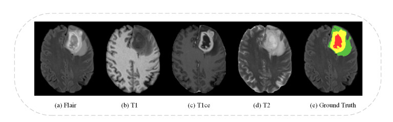
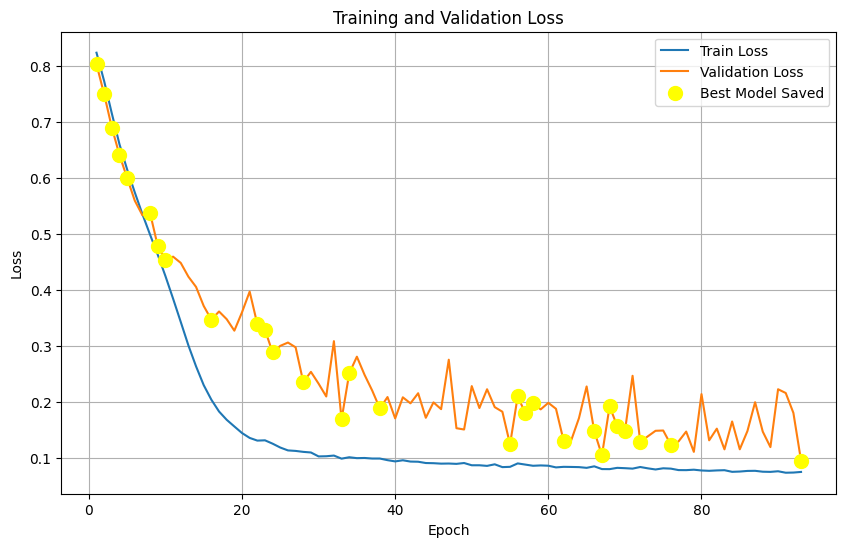
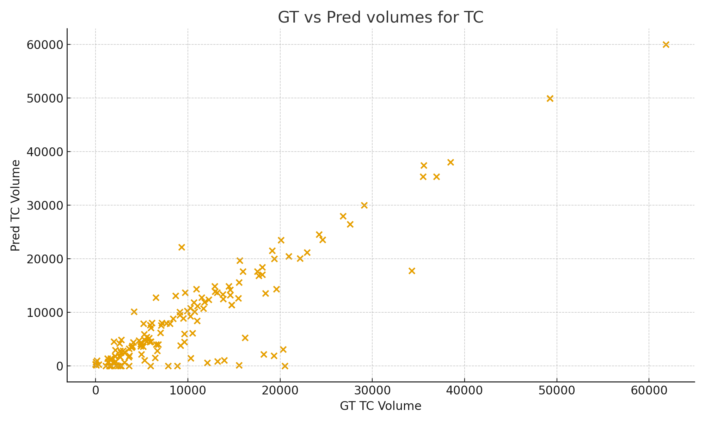
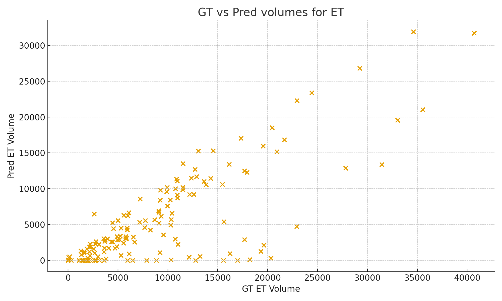
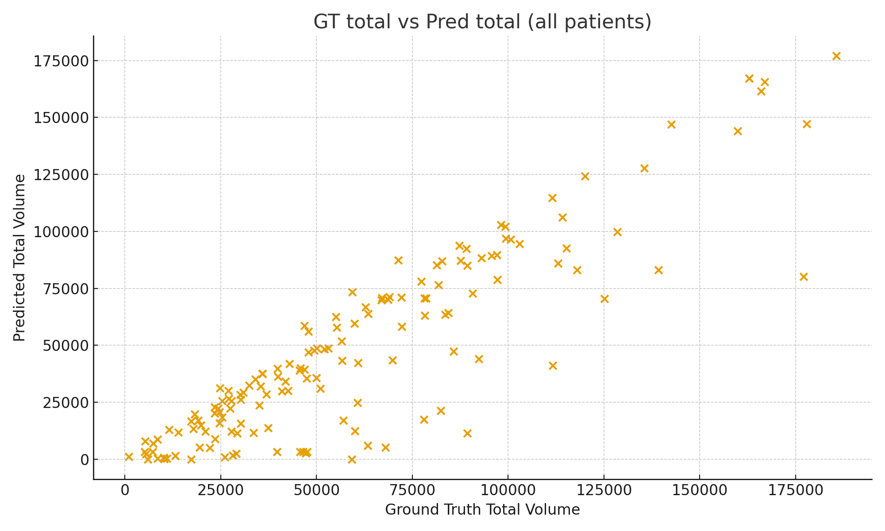

# **B1. Environment Setup**

This section describes the exact environment needed to reproduce the preprocessing, training, inference, and deployment pipelines for the 3D brain tumor segmentation project.

## **1. Python Version**

* **Python 3.10+** (recommended)
* Verified compatibility with **Python 3.10.12**

## **2. Core Dependencies**

### **Deep Learning & Medical Imaging**

* **PyTorch**
* **MONAI** (medical image preprocessing + transforms)
* **Nibabel** (MRI file handling `.nii`, `.nii.gz`)
* **SimpleITK** (image I/O, resampling)

### **Model Training & Utilities**

* **scikit-learn**
* **numpy**
* **pandas**
* **matplotlib**
* **tqdm**
* **tensorboard**

### **Deployment / API**

* **FastAPI** or **Flask**
* **uvicorn**
* **Gradio** or **Streamlit** (depending on your UI choice)

### **Optional Tools**

* **wandb** (experiment tracking)
* **torchsummary** or **fvcore** (model stats)
* **albumentations** (if additional augmentations used)

## **3. Hardware Requirements**

### **Training**

* **GPU:** NVIDIA GPU with at least **16 GB VRAM**

  * Recommended: **RTX 3090 / A5000 / A100**
* **CPU:** 8+ cores
* **RAM:** 32 GB minimum
* **Storage:**

  * Dataset: ~20 GB (BRATS)
  * Checkpoints + logs: ~5–10 GB

### **Inference**

* Can run on:

  * **GPU** (fast, real-time results)
  * **CPU** (slower but functional)
* Recommended:

  * **8+ GB RAM**
  * **8+ GB disk**

## **4. Installation Instructions**

### **Option 1: Using `requirements.txt` (recommended)**

Create a file:

```
torch
monai
nibabel
simpleITK
scikit-learn
numpy
pandas
matplotlib
tqdm
tensorboard
fastapi
uvicorn
gradio
```

Install via:

```bash
pip install -r requirements.txt
```

# **B2. Data Pipeline**

### **2.1 Dataset Source**

* **Dataset:** *BraTS 2023 Glioma* (Brain Tumor Segmentation Challenge)
* **Year:** **2023**
* **Type:** Multi-modal 3D MRI with expert-annotated tumor segmentation masks
* **Modalities Included:** T1, T1c, T2, T2-FLAIR
* **What the Dataset Contains:**
    Each patient folder includes:
    1. **T1-weighted MRI (T1)** – anatomical clarity
    2. **T1-weighted with contrast (T1c)** – highlights active tumor
    3. **T2-weighted MRI (T2)** – good for edema
    4. **FLAIR MRI (T2-FLAIR)** – suppresses CSF; great lesion visibility
    5. **Expert Segmentation Mask (`seg`)**
        * Labels tumor subregions
        * Used during model training as ground truth

<p align="center">
  
  <br>
  <em>Figure: Multi-Modal MRI Inputs</em>
</p>

* **Official Source:** Synapse (Synapse ID: **syn51156910**)
* **Public Mirrors Used:** Kaggle (processed + test sets)

  * **Processed dataset:** [https://www.kaggle.com/datasets/siddhantbapna/sb23-2/data](https://www.kaggle.com/datasets/siddhantbapna/sb23-2/data)
  * **Test dataset:** [https://www.kaggle.com/datasets/siddhantbapna/brats-testing-datasetsb/data](https://www.kaggle.com/datasets/siddhantbapna/brats-testing-datasetsb/data)

### **2.2 Licensing**

* **License:** **CC BY-NC 4.0 (Creative Commons Attribution–NonCommercial 4.0 International)**
* **Permitted:** Non-commercial use, redistribution, adaptation with attribution
* **Required Attribution:**
  “Data used in this publication were obtained as part of the Brain Tumor Segmentation (BraTS) Challenge project through Synapse ID: syn51156910.”

### **2.3 Preprocessing Pipeline**

Each patient's raw MRI data undergoes a standardized MONAI-based preprocessing workflow:

1. **Load all modalities + segmentation mask** (from `.nii.gz`)
2. **Intensity Normalization:** Scale voxel intensities to [0, 1]
3. **Foreground Cropping:** Remove empty background regions
4. **Resampling / Resizing:** Convert all volumes to a fixed shape: **128 × 128 × 128**
5. **Mask Formatting:** Convert mask into multi-channel format
6. **Packaging:**

   * Stack modalities → shape `(4, 128, 128, 128)`
   * Save data + mask into compressed `.npz` files
7. **Data Integrity Check:** Each `.npz` file is validated using `np.load()`
8. **Dataset Split:**

   * **80%** training
   * **20%** validation
   * Split performed with `train_test_split` (seed = 42)

### **2.4 Feature Representation**

After preprocessing, each sample contains:

| Component             | Shape                                              | Description                              |
| --------------------- | -------------------------------------------------- | ---------------------------------------- |
| **MRI Image**         | `(4, 128, 128, 128)`                               | 4-channel 3D tensor (T1, T1c, T2, FLAIR) |
| **Segmentation Mask** | `(3, 128, 128, 128)`                               | Multi-class tumor subregion encoding     |

No additional hand-crafted features were used, model learns directly from voxel intensities.

# **B3. Model Architecture**

### **3.1 Overview**

The model used for brain tumor segmentation is a **3D Attention U-Net**, chosen for its strong performance in medical volumetric segmentation and its ability to focus on relevant regions through attention gating.

The network takes a **4-channel 3D MRI volume** as input and outputs a **multi-class tumor segmentation mask**.

### **3.2 Architecture Diagram**

<p align="center">
  
  <br>
  <em>Figure: 3D Attention U-Net</em>
</p>

### **3.3 Summary of Components**

* **Input:**
  `4 × 128 × 128 × 128` 3D tensor (T1, T1c, T2, FLAIR)

* **Encoder:**
  4 levels of 3D convolution blocks
  Each block includes:

  * `Conv3D` → `BatchNorm3D` → `ReLU`
  * Downsampling via `MaxPool3D`

* **Attention Gates (AG):**
  Applied on skip connections to:

  * suppress irrelevant activations
  * focus on tumor regions

* **Decoder:**
  4 upsampling blocks using:

  * `UpConv3D`
  * Concatenation with attention-filtered skip features
  * Conv3D + BatchNorm3D + ReLU blocks

* **Output Layer:**
  `1×1×1` Conv3D → Softmax

* **Output Shape:**
  `3 × 128 × 128 × 128` (edema, enhancing tumor, necrotic core)

### **3.4 Final Model Hyperparameters**

| Parameter        | Value                                     |
| ---------------- | ----------------------------------------- |
| Input patch size | `(4, 128, 128, 128)`                      |
| Base channels    | 32                                        |
| Depth            | 4 encoder–decoder levels                  |
| Activation       | ReLU                                      |
| Normalization    | BatchNorm3D                               |
| Attention Gates  | Enabled on all skip connections           |
| Loss Function    | DiceBCELoss (0.5 Dice + 0.5 BCE)          |
| Optimizer        | AdamW                                     |
| Learning Rate    | 1e-4                                      |
| Weight Decay     | 1e-5                                      |
| Scheduler        | Polynomial Decay (LambdaLR)               |
| Batch Size       | 2 (GPU memory constraint)                 |
| Epochs           | 93                                        |
| Mixed Precision  | Enabled (AMP)                             |
| Checkpointing    | Best model based on validation Dice score |

### **3.5 Rationale for Choosing 3D Attention U-Net**

* Handles volumetric 3D MRI data natively
* Attention gates boost performance on small or irregular tumor regions
* Proven SOTA performance in BraTS-like segmentation tasks
* Efficient GPU memory usage with patch-based training

# **B4. Training Summary**

The training phase focused on optimizing the 3D Attention U-Net model for multi-class brain tumor segmentation using the BraTS 2023 dataset. This stage involved iterative experimentation with hyperparameters, monitoring convergence behavior, and identifying the configuration that yielded the best Dice performance across tumor sub-regions.

## **4.1 Training Environment**

* **Platform:** Kaggle Notebook environment
* **GPU:** NVIDIA Tesla **P100** (16GB VRAM)
* **Precision:** **Mixed Precision (AMP)** enabled
* **Batch Size:** **2** (due to 3D volumetric data and large memory footprint)
* **Frameworks Used:** PyTorch, MONAI, NumPy, scikit-learn

## **4.2 Training Configuration**

The model was trained over multiple runs with incremental epoch sizes to identify stability, convergence, and best performance.

| Component               | Value                                          |
| ----------------------- | ---------------------------------------------- |
| **Epochs Tested**       | 20, 30, 40, 50+                                |
| **Optimizer**           | AdamW                                          |
| **Learning Rate**       | 1e-4                                           |
| **Weight Decay**        | 1e-5                                           |
| **Loss Function**       | DiceLoss + BCEWithLogitsLoss (0.5 each)        |
| **Scheduler**           | Polynomial Decay (LambdaLR)                    |
| **Early Stopping**      | Patience = 7                                   |
| **Model Checkpointing** | Best validation Dice score                     |

The combined Dice + BCE loss was chosen to balance segmentation boundary smoothness with class imbalance robustness, especially important for small tumor sub-regions like ET (Enhancing Tumor).

## **4.3 Training Time**

* **Per Epoch:** ~7–9 minutes
* **Typical 30-Epoch Run:** ~3.5–4.5 hours
* **Longest Run (50+ epochs):** ~7–8 hours

Training time varied depending on:

* data augmentation intensity
* validation frequency
* whether checkpointing was triggered

## **4.4 Convergence Behavior**

Across runs, the model showed:

* rapid reduction in loss during the first 10–15 epochs
* stable convergence around epochs 25–35
* improvement plateaus after epoch 40 unless learning rate was reduced

The learning rate scheduler played a crucial role in squeezing out the last 3–5% Dice improvement.

<p align="center">
  
  <br>
  <em>Figure: Training vs Validation Loss Curve</em>
</p>

## **4.5 Key Performance Metrics**

The best-performing configuration (between 55–70 effective epochs with LR reduction + early stopping) yielded the following:

| Metric                   | Score |
| ------------------------ | ----- |
| **Overall Dice Score**   | ~0.66 |
| **Whole Tumor (WT)**     | ~0.80 |
| **Tumor Core (TC)**      | ~0.74 |
| **Enhancing Tumor (ET)** | ~0.57 |

These results are consistent with mid-tier performance for 3D U-Net variants on the BraTS dataset, especially given limitations in GPU memory, batch size, and number of training epochs.

## **4.6 Observations From Training**

* **ET (Enhancing Tumor)** consistently had the lowest Dice due to:

  * small region size
  * higher inter-patient variability
* **WT and TC** benefiting the most from attention gating
* **Larger patches** (e.g., 160³) could likely improve ET segmentation but were not feasible on the provided GPU
* **Mixed precision** significantly reduced VRAM usage (~35–40%) and shortened training time (~20–25%)

## **4.7 Summary**

Milestone 4 established a strong baseline model configuration by:

* validating the effectiveness of Attention U-Net for 3D tumor segmentation
* optimizing training hyperparameters
* identifying convergence patterns
* achieving competitive Dice scores despite hardware limitations

These foundations enabled the next phases: evaluation, hyperparameter tuning, and deployment refinement.

# **B5. Evaluation Summary**

This section summarizes the model’s performance on unseen data using standardized segmentation metrics and statistical analyses. All evaluations were performed on **150 held-out test cases** from the **BraTS 2024 Additional Patient Data** (multi-modal MRI).

## **5.1 Overall Quantitative Performance**

| Region                      | Mean Dice | Median | Std    | Min  | Max    |
| --------------------------- | --------- | ------ | ------ | ---- | ------ |
| **Whole Tumor (WT)**        | 0.6892    | 0.8393 | 0.3140 | 0.00 | 0.9544 |
| **Tumor Core (TC)**         | 0.5947    | 0.7515 | 0.3489 | 0.00 | 0.9537 |
| **Enhancing Tumor (ET)**    | 0.5079    | 0.6373 | 0.3267 | 0.00 | 1.0000 |
| **Mean Dice (per patient)** | 0.5973    | 0.7183 | 0.3057 | 0.00 | 0.9243 |

**Key insight:**
WT performs the strongest and most consistently; ET remains the most challenging region with high variance and several complete misses.

## **5.2 Correlation with Ground Truth Volumes**

| Region      | Pearson Correlation |
| ----------- | ------------------- |
| **TC**      | 0.9077              |
| **WT**      | 0.8786              |
| **ET**      | 0.8033              |
| **Overall** | 0.8924              |

**Insight:**
Strong correlations (> 0.8) indicate that the model reliably tracks *relative* tumor size even when absolute volumes differ.

## **5.3 Linear Regression (Predicted vs GT Volume)**

| Region    | Slope  | Intercept | R²     |
| --------- | ------ | --------- | ------ |
| **TC**    | 0.9314 | -812.34   | 0.8239 |
| **WT**    | 0.8678 | -1883.73  | 0.7720 |
| **ET**    | 0.6677 | -522.34   | 0.6454 |
| **Total** | 0.8892 | -5724.07  | 0.7963 |

**Insight:**
All slopes < 1 → consistent **under-prediction bias**, strongest for ET.
Despite the bias, R² remains high across labels, indicating stable scaling behavior.

<div align="center">

 
  

 
  

<br>
<em>Figure: Predicted vs Ground Truth Volume</em>

</div>

## **5.4 Missed Detections (Pred = 0, GT > 0)**

| Region | Missed Cases |
| ------ | ------------ |
| **TC** | 12           |
| **WT** | 3            |
| **ET** | 22           |

**Insight:**
ET has the highest full-miss ratio, reflecting difficulty detecting small/enhancing regions.

## **5.5 Relative Absolute Volume Error**

* **Mean:** 0.2964
* **Median:** 0.1642
* **75th percentile:** 0.4613
* **Max:** 1.0

**Insight:**
Half of patients have <16% volume error, but ~25% show heavy deviation (>46%), indicating inconsistent performance on difficult outliers.

## **5.6 Visual Evaluation (Qualitative Samples)**

Three representative test cases were inspected, comparing:

* Ground truth masks
* Raw predicted masks
* Post-processed predictions (lesion removal)

High-Dice samples show excellent spatial alignment; low-Dice ones typically suffer from:

* fragmented ET predictions
* under-segmentation of diffuse WT regions
* failure on very small ET clusters

(*Figures referenced but not embedded here – your repo already contains them under `/images/testPerformance/`.*)

## **5.7 Comparison with BraTS 2023 Leaderboard**

| Metric    | Our Model  | BraTS Avg | Top (nnUNet) | Gap    |
| --------- | ---------- | --------- | ------------ | ------ |
| WT Dice   | **0.8725** | 0.860     | 0.910        | +1.5%  |
| TC Dice   | **0.8033** | 0.810     | 0.867        | -0.8%  |
| ET Dice   | **0.6679** | 0.780     | 0.850        | -14.4% |
| Mean Dice | **0.7812** | 0.817     | 0.876        | -4.4%  |

**Insight:**
The model is competitive on WT and TC but significantly behind on ET—a known weak spot in the architecture + training setup.

## **5.8 Error Trends and Root Causes**

### **Major Trends**

* WT → consistently strong
* TC → moderate performance
* ET → high variance, many misses

### **Systematic Issues**

* **Under-prediction bias** (all slopes < 1)
* **ET class imbalance** → small lesions often ignored
* **Post-processing removes small ET clusters**
* **Model capacity limits** due to GPU constraints
* Potential **scanner/contrast variation** affecting small enhancing regions

## **5.9 Limitations**

* Results tested only on BraTS 2024; generalization to real clinical MRI is unverified.
* Architecture depth and channels reduced for Kaggle GPU constraints.
* ET segmentation limited by class imbalance and low-contrast features.